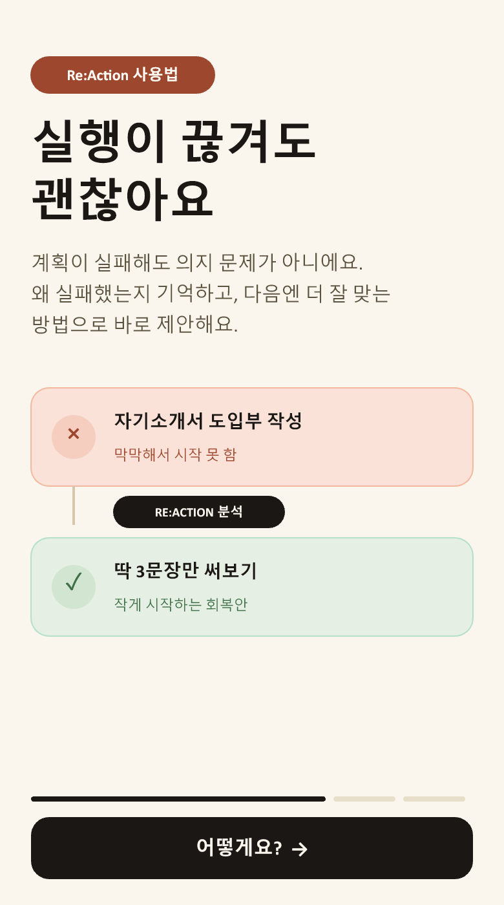
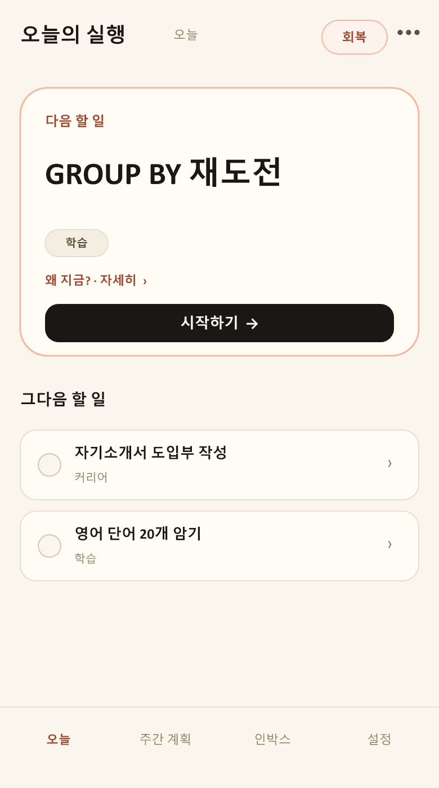
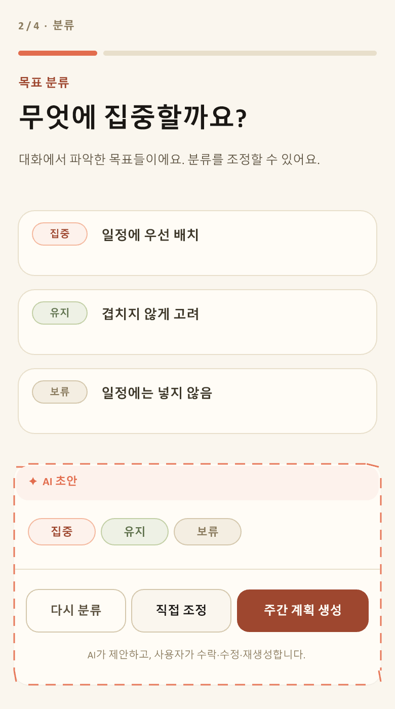
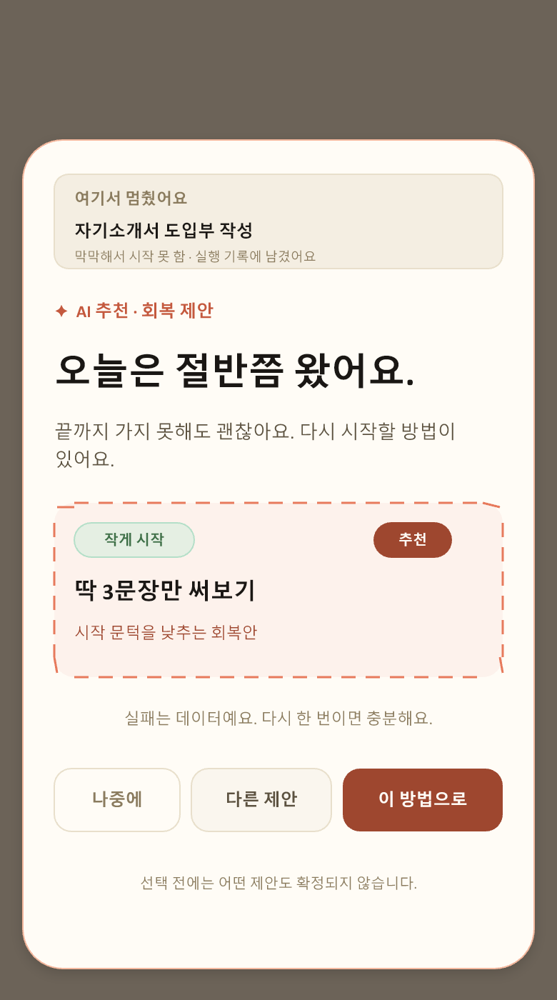
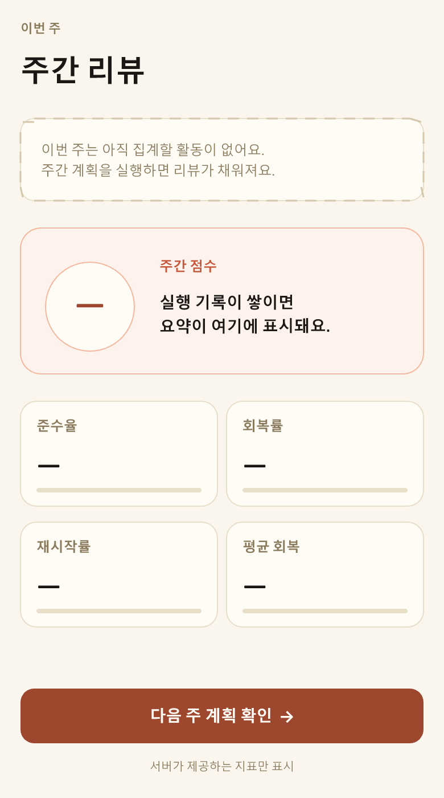
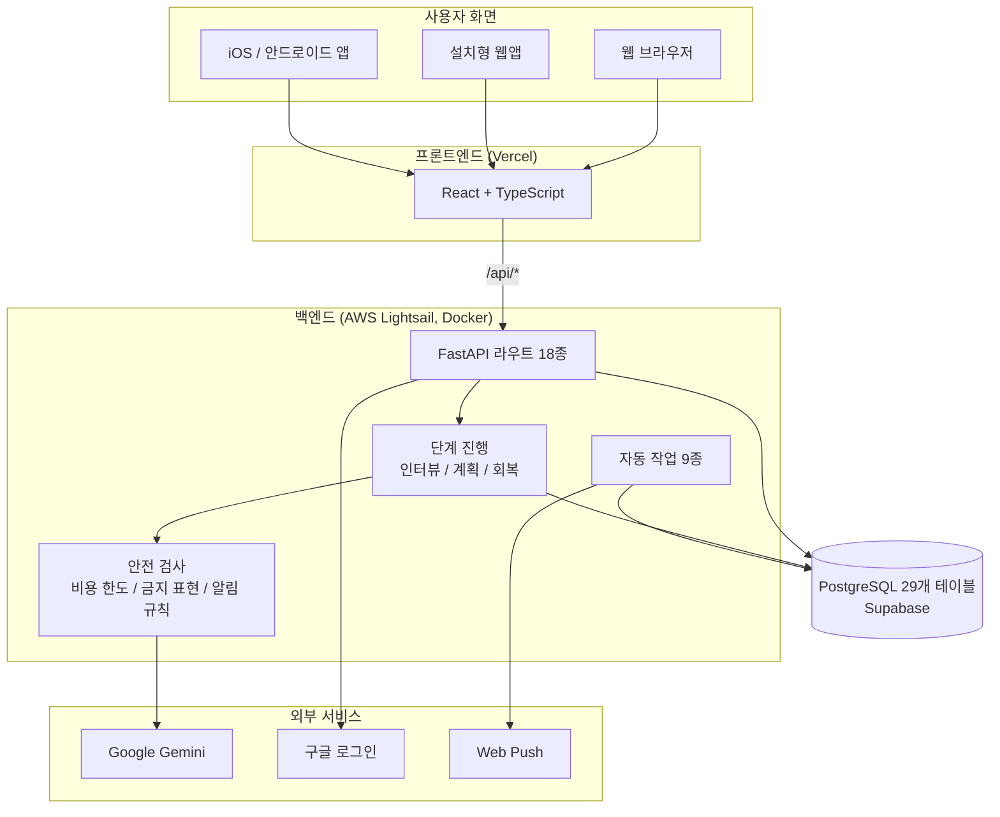
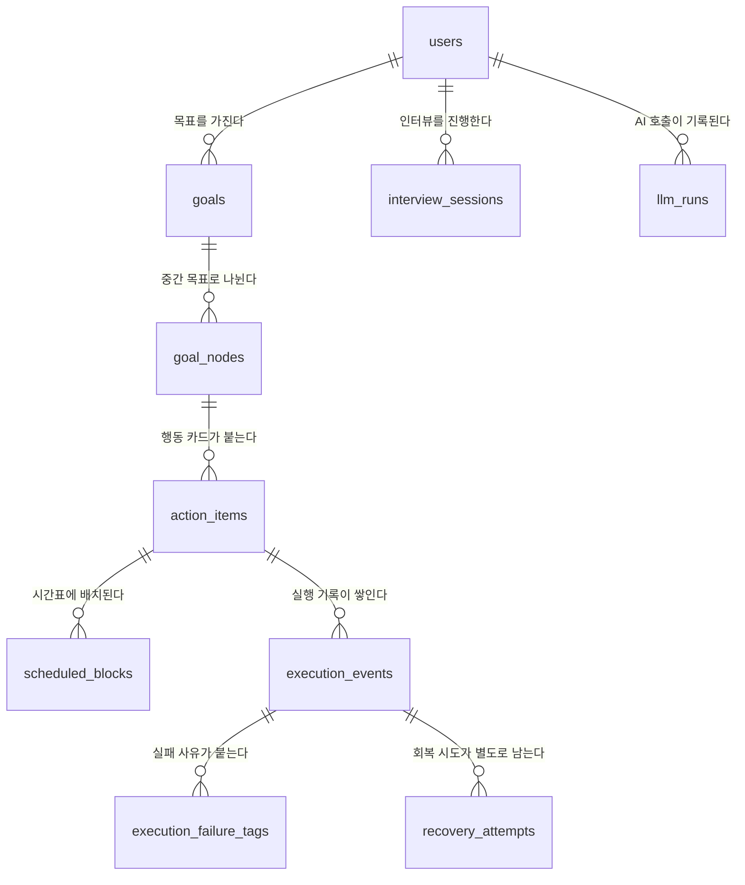

# Re:Action — 다시 시작하게 돕는 AI 실행 코치

> 2026년 한이음 드림업 창의도전형 프로젝트 **26_HA015**

계획이 무너진 다음에 무엇을 할지 함께 정하는 AI 실행 코치입니다. 계획을 세워 주는 서비스는 많지만, 그 계획을 못 지킨 다음을 다루는 서비스는 드뭅니다. Re:Action은 실패를 기록으로 남기고, 더 작게 하거나 시간을 옮기는 회복 행동을 제안해 다시 실행으로 연결합니다.

이 저장소는 심사와 재현을 위한 **통합 제출본**입니다. 프론트엔드와 백엔드의 최신 제출 시점 소스가 각각 `frontend/`, `backend/`에 들어 있어 이 저장소만 내려받아 실행할 수 있습니다. 개발 이력과 이슈는 원본 저장소에서 확인할 수 있습니다.

| 제출본 경로 | 내용 | 원본 개발 저장소 |
| --- | --- | --- |
| [`frontend/`](frontend/) | 웹·PWA·iOS·Android 클라이언트 | [reaction-frontend](https://github.com/hanium-reaction/reaction-frontend) |
| [`backend/`](backend/) | API·AI 오케스트레이션·DB·자동 작업 | [reaction-backend](https://github.com/hanium-reaction/reaction-backend) |
| [`docs/`](docs/) | 제출용 대표 화면 | 이 저장소에서 관리 |

## 빠른 안내

### 무엇이 다른가요?

Re:Action은 계획을 더 많이 만드는 서비스가 아니라 **계획 실패 이후의 복귀를 제품 흐름으로 만든 서비스**입니다.

```text
목표 인터뷰 → 사용자 승인 계획 → 오늘의 실행
                                  ↓ 잘 안됨
                       실패 맥락 기록 → 회복안 선택
                                  ↓
                         재계획 → 다시 실행 → 주간 리뷰
```

- AI는 목표와 문장을 보조하지만, 계획과 회복 행동을 자동 확정하지 않습니다.
- 회복안 후보는 규칙 엔진이 고르고 AI는 문맥에 맞게 표현만 다듬습니다. AI 호출이 실패해도 기본 회복안이 남습니다.
- 실패 기록과 회복 시도를 분리해 보존하므로 준수율뿐 아니라 회복률과 재시작률을 측정할 수 있습니다.
- 장기 목표는 만다라트로 분해하고, 이번에 실행할 축을 실제 주간 계획으로 연결할 수 있습니다.

### 로컬 실행

필수 도구는 Node.js 20 이상, Python 3.12, [uv](https://docs.astral.sh/uv/)입니다. 실제 AI·로그인·DB 연동에는 각 폴더의 `.env.example`을 복사해 환경변수를 채워야 합니다.

```bash
# 터미널 1 — 백엔드
cd backend
uv sync --dev
uv run alembic upgrade head
uv run uvicorn reaction_backend.main:app --reload

# 터미널 2 — 프론트엔드
cd frontend
npm ci
npm run dev
```

기본 접속 주소는 프론트엔드 `http://localhost:5173`, 백엔드 API 문서 `http://localhost:8000/docs`입니다. 전체 환경변수와 시연 계정 설정은 [프론트엔드 README](frontend/README.md)와 [백엔드 README](backend/README.md)를 따릅니다.

### 검증 명령

```bash
cd frontend
npm ci
npm run build
npm test
npm run check:api
npm run check:fields

cd ../backend
uv sync --dev
uv run ruff check .
uv run mypy src
uv run pytest
```

## 1. 프로젝트 개요

### 1-1. 프로젝트 소개

| 항목 | 내용 |
| --- | --- |
| 프로젝트 명 | Re:Action — 다시 시작하게 돕는 AI 실행 코치 |
| 프로젝트 번호 | 26_HA015 |
| 한 줄 정의 | 계획 실패를 기록하고, 사용자가 고른 회복 행동으로 다시 실행에 연결하는 AI 코칭 서비스 |
| 대상 사용자 | 목표는 있지만 계획이 자주 끊기는 청년 대학생 |



### 1-2. 개발 배경 및 필요성

일반적인 플래너와 할 일 앱은 목표를 세우고 일정을 배치하는 데 초점을 맞춥니다. 그런데 사용자가 실제로 이탈하는 지점은 계획을 세우는 순간이 아니라, 계획을 지키지 못한 다음입니다.

- 오늘 못 한 일이 그대로 쌓이면 목록이 밀린 항목으로 가득 차고, 사용자는 앱을 열지 않게 됩니다.
- 왜 못 했는지를 남길 곳이 없으면 같은 실패가 다음 주에도 그대로 반복됩니다.
- 대부분의 앱은 실패를 빨간 표시로 강조할 뿐, 다음 행동을 제안하지 않습니다.

Re:Action은 이 공백을 제품 안으로 가져옵니다. 실패 사유를 고르는 화면, 회복안을 제안하는 화면, 바뀐 계획을 확인하는 화면이 각각 따로 있습니다.

### 1-3. 프로젝트 특장점

- **실패 이후가 제품 안에 있습니다.** 실패 사유 13종 중에서 고르면 그에 맞는 회복 전략으로 이어집니다.
- **AI 결과를 자동으로 적용하지 않습니다.** 모든 AI 제안은 초안이며 사용자가 수락해야 계획이 됩니다. 화면에서도 점선과 실선으로 구분합니다.
- **실패 기록을 덮어쓰지 않습니다.** 회복 시도는 별도 기록으로 남습니다. 실패를 지워 버리면 얼마나 다시 일어섰는지를 측정할 수 없기 때문입니다.
- **AI 응답을 검증 가능한 형태로 관리합니다.** 회복 상황 120건을 정답 세트로 만들어 반복 검증하고, 사용자를 탓하는 표현이 나오지 않는지 별도 사례 10건으로 확인합니다.
- **비용과 안전 장치를 코드로 강제합니다.** AI 호출은 하루 사용 한도와 금지 표현 검사를 통과해야만 나갑니다.
- **장기 목표와 오늘의 행동을 연결합니다.** 궁극적 목표를 8개 축과 64개 실행 항목으로 분해하고, 선택한 축을 이번 계획으로 승격합니다.

### 1-4. 주요 기능

| 기능 | 설명 |
| --- | --- |
| AI 인터뷰 | 대화로 목표, 마감일, 가능한 시간, 선호 리듬을 정리하고 목표를 집중, 유지, 보류로 분류 |
| 첫 계획 생성 | 고정 일정과 시간 규칙을 반영해 중간 목표와 주간 시간표 초안을 만들고 사용자가 승인 |
| 오늘의 실행 | 오늘 할 하나의 행동, 왜 지금인지, 첫 걸음, 예상 소요 시간을 제시하고 집중 타이머 제공 |
| 회고와 회복 | 실패 사유를 최대 2개까지 고르면 "이럴 땐 이렇게" 형태의 회복안을 제안하고 바뀐 계획을 확인 |
| 주간 리뷰 | 계획대로 한 비율, 회복한 비율, 다시 시작한 비율과 시간대별 패턴 확인 |
| Life Inbox | 떠오른 생각을 담아 두었다가 목표나 오늘 할 일로 승격 |
| 알림 | 아침 브리프, 사전 알림, 저녁 회고 세 종류만. 주 3건 이내이고 야간에는 보내지 않음 |
| 궁극적 목표 만다라트 | 장기 목표를 8개 축과 64개 실행 항목으로 분해하고, 셀 편집·완료·이번 목표 승격 지원 |

#### 주요 화면

| 오늘의 실행 | AI 계획 초안 | 회복안 제안 | 주간 리뷰 |
| --- | --- | --- | --- |
|  |  |  |  |

### 1-5. 기대 효과 및 활용 분야

**기대 효과**

- 계획이 한 번 무너졌을 때 앱을 떠나는 대신 다음 행동으로 이어지게 합니다.
- 실패 사유가 데이터로 쌓이면 무리한 계획 습관을 다음 주 계획에 반영할 수 있습니다.
- 사용자를 탓하지 않는 문구 규칙을 시스템 차원에서 강제해, 자기비난으로 빠지지 않도록 돕습니다.

**활용 분야**

- 자격증 준비나 학업 병행처럼 장기 목표를 혼자 관리하는 대학생
- 학습 코칭과 멘토링 프로그램에서 참여자의 실행 상태를 확인하는 보조 도구
- 습관 형성과 재시작 지원이 필요한 자기관리 서비스 전반

위 내용은 설계 의도입니다. 실제 개선 효과 수치는 별도의 실험이나 운영 데이터로 검증해야 합니다.

### 1-6. 기술 스택

| 구분 | 기술 |
| --- | --- |
| 프론트엔드 | React 18, TypeScript 5, Vite 5, React Router 7, Tailwind CSS 3 |
| 모바일 | 설치형 웹앱(Web App Manifest, Service Worker, Web Push), Capacitor 8 기반 iOS와 안드로이드 |
| 백엔드 | Python 3.12, FastAPI, Pydantic, SQLAlchemy 비동기, Alembic, APScheduler |
| AI | Google Gemini, 영역별 지시문 13개 버전 관리, 호출 전 비용과 안전 검사 |
| 데이터베이스 | PostgreSQL 17 (Supabase), 테이블 29개 |
| 클라우드 | AWS Lightsail Container (서울 리전), Vercel |
| 배포와 관리 | Docker, GitHub Actions, uv, ruff, mypy, pytest |

## 2. 팀원 소개

| 이름 | GitHub | 소속 | 담당 역할 |
| --- | --- | --- | --- |
| 김종민 (팀장) | [@Mbt70](https://github.com/Mbt70) | 한양대학교 | 프로젝트 총괄과 일정 관리, 백엔드 기능 개발 |
| 조성욱 | [@peterchopg](https://github.com/peterchopg) | 성균관대학교 | 백엔드 전반, 계획과 회복 단계 진행, 데이터 모델 설계 |
| 임형준 | [@hyeongjun22](https://github.com/hyeongjun22) | 숭실대학교 | 백엔드 API, AI 인터뷰와 초기 설정, 자동 작업 |
| 장준혁 | [@choigod1023](https://github.com/choigod1023) | 동국대학교 | 프론트엔드 전반, 화면 설계와 디자인 시스템, 백엔드와 프론트 연동 |

## 3. 시스템 구성도

### 서비스 구성도



### 데이터 구조 요약



핵심은 `execution_events`와 `recovery_attempts`의 관계입니다. 회복 시도를 별도 표에 남기고 원래 실행 기록의 상태값은 바꾸지 않습니다. 실패를 지우지 않아야 회복률을 측정할 수 있기 때문입니다.

전체 29개 테이블 구조는 [ERD 문서](https://github.com/hanium-reaction/reaction-backend/blob/main/docs/erd-diff.md)에 있습니다.

## 4. 작품 소개영상

> 소개영상 링크는 최종 제출 자료 확정 후 이 위치에 연결합니다. 현재 저장소에는 검증되지 않은 임시 링크를 넣지 않았습니다.

## 5. 핵심 소스코드

이 서비스의 핵심은 **실패를 회복 행동으로 잇는 흐름**입니다. 그 흐름이 백엔드와 프론트엔드에서 각각 어떻게 구현되어 있는지를 순서대로 보여 드립니다.

```text
[프론트] 실패 사유 선택  →  [백엔드] 규칙으로 회복 카드 선택  →  [백엔드] AI가 문구만 다듬음
                                                                        ↓
                        [프론트] AI 초안임을 표시하고 사용자가 선택  ←  회복 카드 2~4장
                                        ↓
                        [프론트] 서버 저장 성공 후에만 다음 화면
```

### 5-1. 백엔드 — 실패 사유에서 회복 카드를 고르는 규칙 엔진

회복안 후보를 고르는 일은 **AI가 아니라 규칙**이 합니다. 실패 사유와 전략의 발동 조건을 맞춰 점수를 매기고, 성격이 같은 전략은 그룹당 하나만 남긴 뒤 2장에서 4장을 내보냅니다.

여기서 중요한 부분은 마지막 조건입니다. 매칭되는 전략이 하나도 없어도 빈 화면을 보여 주지 않고, 아직 쓰지 않은 그룹에서 카드를 채웁니다. 사용자가 사유를 고르지 않았거나 애매하게 골랐을 때도 **다음 행동을 반드시 제시한다**는 제품 원칙을 코드로 지킨 것입니다.

[`backend/src/reaction_backend/orchestrator/recovery.py`](backend/src/reaction_backend/orchestrator/recovery.py)

```python
def select_strategies(
    failure_tags: list[str],
    strategies: list[RecoveryStrategyCatalog],
    *,
    min_cards: int = MIN_CARDS,   # 2
    max_cards: int = MAX_CARDS,   # 4
) -> list[RecoveryStrategyCatalog]:
    """실패 태그 → 전략 카드 선택. (LLM 호출 0회)

    1. 발동 태그와 실패 태그의 교집합 크기로 점수화
    2. 같은 성격의 그룹은 최고 점수 1개만
    3. 점수 내림차순 → 표시 우선순위 오름차순으로 최대 4장
    4. 매칭이 2장 미만이면 아직 없는 그룹에서 채운다
       (태그가 없거나 모호해도 항상 선택지를 보여준다)
    """
    active = [s for s in strategies if s.is_active]
    tag_set = set(failure_tags)

    best_by_group: dict[str, tuple[int, RecoveryStrategyCatalog]] = {}
    for s in active:
        score = len(tag_set & set(s.primary_trigger_tags or []))
        if score <= 0:
            continue
        current = best_by_group.get(s.option_group)
        if current is None or (score, -s.display_priority) > (
            current[0], -current[1].display_priority,
        ):
            best_by_group[s.option_group] = (score, s)

    cards = [s for _, s in sorted(best_by_group.values(),
                                  key=lambda t: (-t[0], t[1].display_priority))]

    if len(cards) < min_cards:          # 빈손으로 돌려보내지 않는다
        used_groups = {c.option_group for c in cards}
        for s in sorted(active, key=lambda x: x.display_priority):
            if len(cards) >= min_cards:
                break
            if s.option_group in used_groups:
                continue
            cards.append(s)
            used_groups.add(s.option_group)

    return cards[:max_cards]
```

### 5-2. 백엔드 — AI는 문구만 다듬고, 실패하면 규칙 결과가 그대로 나간다

AI에게는 "무엇을 할지 고르라"가 아니라 "이미 정해진 전략의 문장을 이 사용자 상황에 맞게 다듬으라"고만 시킵니다. 그래서 AI 응답이 늦거나 실패해도 회복 카드는 그대로 나갑니다. `fallback` 인자에 미리 계산해 둔 기본 문구를 넘겨 두었기 때문입니다.

AI가 멈추면 서비스도 멈추는 구조를 피하려고 이렇게 설계했습니다.

[`backend/src/reaction_backend/api/routes/recovery.py`](backend/src/reaction_backend/api/routes/recovery.py)

```python
# 규칙이 고른 선두 카드의 문구를 이 사용자 맥락에 맞게 다듬는다.
# 전략 선택은 이미 끝났으므로 AI 는 새 전략을 고르지 않는다.
top = selected[0]
result = await aiClient.run(
    module="recovery",
    schema=RecoveryProposalLLM,
    prompt_id="recovery/if_then_proposal",
    fallback=lambda: RecoveryProposalLLM(       # AI 실패 시 그대로 쓰는 기본값
        strategy_code=top.strategy_type,
        if_clause="",
        then_clause=texts[top.strategy_type],   # 카탈로그 템플릿 문구
        rationale="",
    ),
    thinking_budget=0,
    timeout=12.0,
    ...
)
```

### 5-3. 프론트엔드 — AI 초안임을 화면에서 구분하고, 금지 표현을 한 번 더 거른다

AI가 만든 것은 점선 테두리와 `AI 초안` 배지로 감싸고 `수락 / 수정 / 거절` 세 버튼을 함께 붙입니다. 사용자가 확정한 계획은 실선입니다. AI가 아니라 규칙으로 만든 결과일 때는 배지 문구도 다르게 표시합니다.

여기에 더해, 서버에서 이미 걸러진 문구라도 화면에서 한 번 더 검사합니다. "실패", "또", "못했" 같은 표현이 사용자에게 닿으면 안 된다는 제품 규칙 때문입니다.

[`frontend/src/components/AiDraftCard.tsx`](frontend/src/components/AiDraftCard.tsx)

```tsx
// 잠금 결정: 백엔드 필터를 통과한 뒤에도 화면에서 한번 더 검수한다.
const FORBIDDEN_PATTERNS: RegExp[] = [
  /실패/,
  /(?:^|[^가-힣])또(?:[^가-힣]|$)/,
  /안\s?됐/,
  /못했/,
  /왜\s*안/,
  /실패율/,
];

// AI 초안은 점선, 사용자가 확정한 계획은 실선
<div style={{ border: `1.5px dashed ${borderColor}`, borderRadius: 14 }}>
  <div style={{ background: headerBg, color: accentColor }}>
    {isLlm ? <Sparkle size={11} weight="fill" /> : <Robot size={11} weight="fill" />}
    <span>{isLlm ? 'AI 초안' : '오프라인 모드 · 룰 기반'}</span>
  </div>
  {children}
</div>
```

### 5-4. 프론트엔드 — 회복안은 서버 저장에 성공해야 다음 화면으로 넘어간다

가장 많이 고쳤던 부분입니다. 처음에는 버튼을 누르는 즉시 완료 화면으로 넘어갔는데, 서버 저장이 422 오류로 실패해도 사용자는 성공한 줄 알았습니다. 다시 접속하면 선택이 사라져 있었습니다.

지금은 저장 응답을 받은 뒤에만 화면을 넘깁니다. 실패하면 현재 화면을 유지하고 이유를 보여 줍니다. 같은 요청이 두 번 가도 계획이 두 번 바뀌지 않도록 요청마다 구분 값을 함께 보냅니다.

[`frontend/src/screens/RecoveryScreen.tsx`](frontend/src/screens/RecoveryScreen.tsx)

```tsx
const accept = async () => {
  if (!sel || deciding) return;
  const chosen = proposals.find((p) => p.id === sel);

  // 예전엔 실패를 조용히 삼켜서, 회복 계획이 안 만들어졌는데도
  // "복구 계획이 준비됐어요" 로 넘어갔다. 이제는 저장에 실패하면 진행하지 않는다.
  if (executionId) {
    setDeciding(true);
    setDecideError(null);
    try {
      await recoveryApi.decide(
        { executionId, decision: 'accepted', acceptedAttemptId: sel },
        `rec-${executionId}-${sel}`,        // 중복 방지 키
      );
    } catch (err) {
      setDecideError(friendlyError(err, '회복 계획을 저장하지 못했어요. 잠시 후 다시 시도해 주세요.'));
      return;                                // 화면을 넘기지 않는다
    } finally {
      setDeciding(false);
    }
  }
  setAccepted(true);
  if (chosen) setTimeout(() => onAccept(chosen), 1400);
};
```

### 그 밖의 안전 장치

| 기능 | 위치 |
| --- | --- |
| AI 호출 전 사용자별 하루 사용 한도 검사 | [`backend/src/reaction_backend/safety/llm_budget.py`](backend/src/reaction_backend/safety/llm_budget.py) |
| 계획 승인을 단일 트랜잭션으로 저장하고 중복 승인 방지 | [`backend/src/reaction_backend/api/routes/planning.py`](backend/src/reaction_backend/api/routes/planning.py) |
| 알림 주 3건 제한과 야간 발송 차단 | [`backend/src/reaction_backend/safety/push_gate.py`](backend/src/reaction_backend/safety/push_gate.py) |
| 주간 시간표에서 일정을 15분 단위로 옮기기 | [`frontend/src/screens/WeeklyCalendarScreen.tsx`](frontend/src/screens/WeeklyCalendarScreen.tsx) |

## 프로젝트 검증 현황

| 항목 | 현황 |
| --- | --- |
| 프론트엔드 빌드 | `npm run build` 통과 |
| 프론트엔드 자동 테스트 | 14건 통과 (`npm test`) |
| 프론트엔드 API 계약 | 경로·필드 검사 통과. 최신 Inbox 코칭 endpoint의 OpenAPI 동기화 경고 1건은 후속 반영 대상 |
| 백엔드 정적 검사 | `ruff check .`, `mypy src` 통과 |
| 백엔드 자동 테스트 | 1,997건 통과, 168건 건너뜀 (`uv run pytest -q` 기준) |
| 회복안 품질 평가 | 정답 세트 120건 (단일 사유 52, 복수 사유 26, 회귀 12, 경계값 20, 자기비난 방어 10) |
| AI 지시문 | 영역별 13개 파일, 버전 관리 |
| 데이터베이스 | 설계서 대비 테이블 29개 일치 |

위 결과는 2026-09-01 제출본에서 직접 실행해 확인했습니다. 제출본은 프론트엔드 [`9fcdc00`](https://github.com/hanium-reaction/reaction-frontend/commit/9fcdc00429346c77e537d11f93b5e2a7d530a29a), 백엔드 [`2d9c666`](https://github.com/hanium-reaction/reaction-backend/commit/2d9c6666a1ca1512f55567712c9c500d7325460e)를 기준으로 동기화했습니다.

## 현재 제한 사항과 다음 단계

숨기지 않고 그대로 적습니다. 각 항목이 지금 어디까지 되어 있고 다음에 무엇을 하는지 함께 적었습니다.

| 항목 | 현재 상태 | 다음 단계 |
| --- | --- | --- |
| 구글 캘린더 연동 | 연결과 읽기, 쓰기 모두 임시 응답. 고정 일정은 사용자가 직접 입력 | 빈 시간 조회를 먼저 붙여 계획 생성에 반영하고, 쓰기는 그 뒤에 검토합니다 |
| 앱 자체 알림 | iOS와 안드로이드에서는 브라우저 알림만 동작 | 앱 껍데기에 푸시 토큰 등록을 붙이고, 발송 규칙(주 3건, 야간 금지)은 서버 쪽을 그대로 씁니다 |
| 오프라인 사용 | 지원하지 않음. 인터넷이 끊기면 화면을 쓸 수 없음 | 오늘 할 일과 실행 기록만 먼저 저장해 두고, 연결되면 서버와 맞추는 방식을 검토합니다 |
| 자동 작업 운영 | 서버 한 대 운영을 전제. 여러 대로 늘리면 중복 실행 가능 | 실행 이력을 데이터베이스에 남겨 같은 작업이 두 번 돌지 않게 막습니다 |
| 성과 검증 | 회복안 품질은 정답 세트 120건으로 검증. 실제 사용자 지표는 없음 | 베타 사용자 대상으로 계획 준수율과 회복률을 모아 설계 의도가 맞는지 확인합니다 |

여기 적은 다음 단계는 계획이며, 아직 구현되지 않았습니다. 완료 여부는 각 저장소의 이슈와 PR에서 확인할 수 있습니다.
