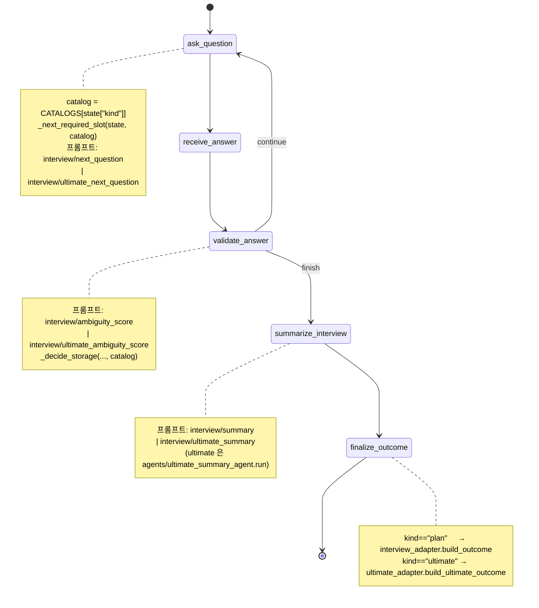
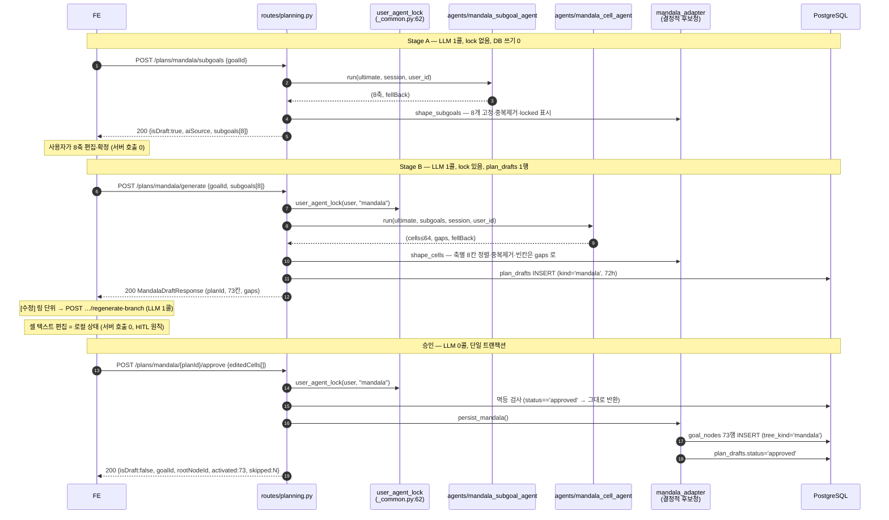

# 궁극적 목표(Ultimate Goal) — 만다라트 맵 기능 전략서

> 대상 레포: `/Users/imhyeongjun/Desktop/reaction/.claude/worktrees/mandala-map-ultimate-goal-2bdf25`
> 산출물: **(1) 프론트엔드 설계 = API 계약 + 화면 + 렌더링 전략**, **(2) 에이전트 구조 = 호출 규약 + 상태 흐름 + PR 계획**
> 모든 주장은 `파일:줄` 근거를 단다. 근거 없는 문장은 "제안"으로 표기한다.

---

## §0. 결론 요약

### 0.1 세 줄

1. **엔진은 공짜다.** 인터뷰 턴 드라이버(`interview_runner.py`)·LangGraph 5노드(`interview.py:1147-1169`)·슬롯 영속(`routes/interview.py:256-272`)은 슬롯키 결합이 0이라 `kind` 문자열 하나로 갈라진다. 실제로 새로 쓰는 건 **카탈로그 1개 + Outcome 어댑터 1개 + 프롬프트 6개 + 에이전트 3개**뿐이다. 대신 §2.7 의 **함정 8곳을 반드시 같이 고쳐야 한다** — 안 고치면 "(미입력 목표)" 계획 생성 + 주간 재계획 튜닝 리셋이라는 즉시 장애다.
2. **`goal_nodes` 는 이 기능을 예상하고 만들어졌다.** `goal_node.py:1` docstring 이 "목표 만다라트 분해 트리", `:60` 주석이 "형제 노드 간 순서 **(만다라트 1~8)**", `action_items.goal_node_id` FK 가 이미 존재한다(`action_item.py:112-116`). `tree_kind` 컬럼 하나로 계획 트리와 분리하면 **additive 마이그레이션 2건**으로 73칸 + 진척도 롤업이 전부 열린다.
3. **만다라트의 가치는 격자가 아니라 여백이다.** 사용자가 인터뷰에서 말한 축은 `locked` 로 AI 가 못 건드리게 하고, AI 가 못 채운 칸은 억지 패딩 대신 `source='rule'` 로 표시해 FE 가 점선 렌더한다. 승인 후에도 `source`/`why_text`/`completed_at` 으로 누가 썼는지·왜인지·직접 체크했는지를 보존하고, **오늘 화면과 모닝 브리프에 꽂아(PR7)** 죽은 문서가 되는 걸 막는다.

### 0.2 잠금 결정 (문서 전체에서 이 값으로 고정)

| # | 결정 | 값 | 근거 |
|---|---|---|---|
| D1 | 궁극목표 저장 위치 | **기존 `goals` 행 1개**. 신규 테이블 없음. `status='active'`, `goal_tier='parked'` **생성 시점부터** | §3.2. `goal.py:29` tier 3종, `routes/goals.py:42` Parked 한도 자유 |
| D2 | 만다라 트리 저장 | `goal_nodes` **73행**(1+8+64), `tree_kind='mandala'`, `goal_id` = 궁극목표 행 (**NOT NULL 유지**) | §3.3. 81행 저장 금지(중복 8칸) |
| D3 | 신규 PG enum 타입 | **0개.** `kind`/`tree_kind`/`source` 는 `String(16)` + CHECK | §3.5. `f5a6b7c8d9e0:26-29` enum ADD VALUE 함정 회피 |
| D4 | 프롬프트 도메인 | **신설 0.** `interview/` 3개 + `planning/` 3개 | `registry.py:30-41` 8종 잠금 |
| D5 | `llm_runs.module` | `planning`(만다라 2종) / `interview`(요약) — **신설 0** | `llm_run.py:48-54` DB Enum 5종 |
| D6 | 신설 에러코드 | **0개.** 기존 6종 재사용 | §6.3 |
| D7 | 신규 라우터 파일 | **0개.** `routes/planning.py` + `routes/goals.py` 에 추가 | AGENTS §4 |
| D8 | SSE / WebSocket / 202+폴링 | **전부 미도입.** 요청당 LLM **1콜**로 쪼개 최악 135초 | §9 |
| D9 | `renderHint` 응답 필드 | **미채택.** 좌표는 `(depth, parent.order_index, order_index)` 로 완전 파생 | §7.3 |
| D10 | 신규 화면 ID | **S29 / S30 / S31 / S32** (S29+ 는 현재 전부 미사용) | §7.1 |

---

## §1. 무엇을 만드는가

### 1.1 제품 정의

오타니 쇼헤이의 만다라트를 그대로 옮긴다.

```
┌────────┬────────┬────────┐   9×9 = 81칸
│ 블록0  │ 블록1  │ 블록2  │   - 중앙 블록(4)의 한가운데 = 궁극적 목표
├────────┼────────┼────────┤   - 중앙 블록의 나머지 8칸 = 하위 목표 8개
│ 블록3  │ 블록4★ │ 블록5  │   - 하위 목표 k 는 블록 SLOT[k] 의 한가운데로 **재등장**
├────────┼────────┼────────┤   - 그 블록의 나머지 8칸 = 그 하위 목표의 실행 항목
│ 블록6  │ 블록7  │ 블록8  │
└────────┴────────┴────────┘   저장 행 수 = 1 + 8 + 64 = 73 (중복 렌더 8칸은 저장하지 않는다)
```

### 1.2 사용자 여정 (기존 기능과의 접합)

```
              [기존]                                    [신규]
S02 딥 인터뷰(kind=plan) ──┐
                            │
S26 목표 화면 ──[궁극적 목표 세우기]──▶ S29 궁극목표 인터뷰(kind=ultimate, 필수 9슬롯)
                                              │ 종료 턴 → UltimateGoalOutcome
                                              ▼
                                        S30 만다라트 초안 (Stage A → Stage B, HITL 3버튼)
                                              │ 승인
                                              ▼
                                        S31 만다라트 상시 뷰 (goal_nodes 73행)
                                              │ 셀 탭
                                              ▼
                                        S32 셀 상세 — [승격] 하위목표 → Goal(proposed)
                                              │
S02 딥 인터뷰(kind=plan) ◀─────────────────────┘  goals.heaviest 동적 보기 = 만다라 8축
     └─▶ S06 첫 계획 → approve → action_items + scheduled_blocks
```

**핵심 접합점**: 궁극목표 인터뷰의 8축이 다음 계획 인터뷰의 `goals.heaviest` **동적 보기**로 내려간다(`routes/interview.py:172-187` 의 `goals.heaviest` 분기 확장). "이번 학기엔 8칸 중 어느 축을 굴릴래요?" — 이것이 만다라트를 죽은 그림이 아니게 만드는 유일한 장치다.

### 1.3 온보딩 상태머신은 건드리지 않는다

`users.onboarding_state` 전이표는 `api-contract.md:137-144` 로 고정이고, 새 상태 추가 = enum 마이그레이션 = AGENTS §8 사람 합의다. 궁극목표는 **온보딩 밖의 독립 기능**으로 두고 S26(Goals) 에서 진입한다. 근거: `POST /plans/milestones`(`routes/planning.py:303-322`)가 이미 `onboarding_state` 를 전혀 건드리지 않는 중간 HITL 단계 전례다.

---

## §2. 인터뷰 엔진 재사용 — `kind` 파라미터화

### 2.1 재사용 판정 요약

| 컴포넌트 | 위치 | 판정 |
|---|---|---|
| 턴 드라이버 전체 | `interview_runner.py:92-182` | 🟢 **무변경** (슬롯키 문자열 0개) |
| LangGraph 5노드 배선 | `interview.py:1147-1169` | 🟢 무변경 |
| 종료 판정 | `interview.py:668-685` | 🟢 무변경 |
| 값 정규화 / 스킵 감지 | `interview.py:750-781`, `:696-708` | 🟢 무변경 (answer_type 기반) |
| 슬롯 영속·재조립 | `routes/interview.py:148-162`, `:256-272` | 🟢 무변경 (JSONB slot_key→value) |
| 저장 결정 `_decide_storage` | `interview.py:880-954` | 🟡 catalog 인자화 |
| 질문/채점/하베스트 노드 | `interview.py:413-455`, `:467-523`, `:535-626` | 🟡 catalog 인자화 |
| `build_outcome` | `interview_adapter.py:157-297` | 🔴 신규 (`ultimate_adapter`) |
| 슬롯 카탈로그 | `api/mock/interview.py:30-222` | 🔴 신규 + 이전 |
| 프롬프트 3종 | `prompts/interview/*.v1.md` | 🔴 신규 3개 |

### 2.2 FSM 흐름 — `kind` 분기 위치



**그래프 자체는 변경 0.** 노드 5개·엣지 6개 그대로다(`interview.py:1152-1169`). 바뀌는 것은 각 노드 안의 상수 조회가 `state["kind"]` 를 경유한다는 점뿐이다.

### 2.3 `InterviewCatalog` — 흩어진 모듈 상수 7개를 한 곳으로

현재 `orchestrator/interview.py` 에 도메인 상수가 7곳 흩어져 있다:

| 상수 | 줄 | 흡수 후 필드명 |
|---|---|---|
| `CRITICAL_SLOTS` | `interview.py:82` | `critical_slots` |
| `_HARVEST_EXCLUDE` | `:94` | `harvest_exclude` |
| `_PER_GOAL_SLOTS` | `:101-114` | `per_goal_slots` |
| `REQUIRED_SLOT_SEQUENCE` | `:183` (import 시점 바인딩) | `required_keys` |
| `_CONTEXT_LABELS` | `:187-206` | `context_labels` |
| `_DEADLINE_SLOT` | `:858` | `deadline_slot` |
| `_DEFAULT_SLOT_QUESTIONS` | `:1120-1144` | `default_questions` |

```python
# src/reaction_backend/orchestrator/interview_catalog.py (신규)
@dataclass(frozen=True, slots=True)
class InterviewCatalog:
    kind: str                               # "plan" | "ultimate"
    slots: tuple[InterviewSlot, ...]
    required_keys: tuple[str, ...]
    critical_slots: frozenset[str]
    harvest_enabled: bool                   # ultimate = False (§2.6)
    harvest_exclude: frozenset[str]
    per_goal_slots: tuple[str, ...]
    default_questions: Mapping[str, str]
    context_labels: Mapping[str, str]
    deadline_slot: str | None
    prompt_next_question: str               # "interview/next_question" | "interview/ultimate_next_question"
    prompt_ambiguity: str
    prompt_summary: str
    by_key: Mapping[str, InterviewSlot]     # __post_init__ 파생

CATALOGS: dict[str, InterviewCatalog] = {"plan": PLAN_CATALOG, "ultimate": ULTIMATE_CATALOG}
```

⚠️ **`InterviewState` 에는 catalog 객체가 아니라 `kind: str` 만 싣는다.** State 는 직렬화 가능해야 한다(ADR-0005 §7.1, `interview.py:212`). 각 노드가 `CATALOGS[state["kind"]]` 로 조회한다.

### 2.4 `api/mock/interview.py` 처리 방침 — **이전한다**

현재 프로덕션 FSM 과 라우터가 **mock 모듈을 import** 하고 있다(`routes/interview.py:42`). 이건 폴더 규칙 위반이 이미 발생한 상태다.

| 참조 | 줄 | 처리 |
|---|---|---|
| `from ...api.mock.interview import SLOT_CATALOG, InterviewSlot` | `routes/interview.py:42` | → `from ...orchestrator.interview_catalog import CATALOGS, InterviewSlot` |
| `_CATALOG_BY_KEY = {s.slot_key: s for s in SLOT_CATALOG}` (모듈 전역) | `:90` | **삭제** → 요청 스코프 `catalog.by_key` |
| `_REQUIRED_KEYS = interview_adapter.REQUIRED_SLOT_KEYS` (모듈 전역) | `:91` | **삭제** → `catalog.required_keys` |
| `_slot_meta` 의 `for s in SLOT_CATALOG` | `:131-138` | → `for s in catalog.slots` |
| `GET /interview/slot-catalog` 의 `for s in SLOT_CATALOG` | `:361` | → `for s in CATALOGS[kind].slots` (§6.1 U0) |

`api/mock/interview.py` 는 **파일을 지우고** `interview_catalog.py` 로 옮긴다. 별칭 재수출(`SLOT_CATALOG = PLAN_CATALOG.slots`)은 두지 않는다 — 남기면 두 번째 진실이 생긴다.

### 2.5 궁극목표 슬롯 카탈로그 (필수 9 + 선택 3)

| slot_key | answer_type | 필수 | 역할 |
|---|---|---|---|
| `ultimate.statement` | text | ✅ CRITICAL | 궁극 목표 본문 ("메이저리그 8구단 드래프트 1순위") |
| `ultimate.domain` | chip(8) | ✅ | 8축 프리셋 선택 키 + `goals.category` 매핑 |
| `ultimate.horizon` | chip(6) | ✅ | 3/5/7/10/10+/무기한 |
| `ultimate.measure` | text | ✅ CRITICAL | 판정 가능성 (숫자·사건·자격) |
| `ultimate.success_image` | text | ✅ | 이룬 날의 장면 |
| `ultimate.identity` | text | ✅ | 그때의 나는 어떤 사람인가 |
| `ultimate.current_position` | text | ✅ | 지금 위치 (baseline) |
| `ultimate.pillars_hint` | text | ✅ | **8축 시드** — 비면 LLM 이 도메인 프리셋으로 채움 |
| `ultimate.constraints` | text | ✅ | 걸림돌 (현실성 가드) |
| `ultimate.values` | chip(8) | ⬜ | 타협 불가 가치 |
| `ultimate.assets` | text | ⬜ | 이미 가진 무기 |
| `ultimate.role_model` | text | ⬜ | 선례 |

**필수를 9개로 묶은 이유**: 계획 인터뷰는 필수 18개(`interview_adapter.py:32-58`)이고 `MAX_SLOT_ATTEMPTS=3`(`interview.py:88`)이라 최악 54턴이다. 궁극목표는 질문 하나하나가 무거워서 턴이 길면 이탈한다.

`ultimate.pillars_hint`·`ultimate.constraints` 가 필수인데 "없으면 넘겨도 돼요" 인 이유: `_decide_storage` 가 빈 답을 즉시 스킵 마커로 통과시킨다(`interview.py:914-915`). 기존 `goals.approach` 와 같은 패턴이다.

### 2.6 CARRY_OVER 이월 규칙

| 방향 | 상수 | 동작 |
|---|---|---|
| 계획 → 궁극목표 | `CARRY_OVER_SLOT_KEYS` (`interview_adapter.py:64-77`) **그대로 재사용** | `identity.*`/`recovery.*` 는 톤 결정에 쓰인다. `_carry_over_answers`(`routes/interview.py:275-306`)에 `target_kind` 인자만 추가 |
| 궁극목표 → 계획 | `ULTIMATE_CARRY_OVER_SLOT_KEYS` **신규 상수** | `ultimate.*` 는 몇 년에 한 번 바뀌는 값이라 전량 이월 대상. 기존 상수 주석(`:60-63`)은 "매 주기 바뀌는 goals.* 제외"라는 정반대 전제로 쓰였다 |
| 궁극목표 → `goals.list` 자동 채움 | **금지** | 궁극목표는 10년, `goals.list` 는 한 학기. `slot_meta.options` 로 내려 사용자가 **고르게** 한다(HITL) |

**하베스팅은 ultimate 에서 끈다** (`harvest_enabled=False`). `harvest_slots`(`interview.py:535-626`)는 `_PER_GOAL_SLOTS` 10개(전부 `goals.*`)를 전제로 만들어졌고, 궁극목표 슬롯 9개는 서로 독립이라 교차 추출 이득이 없다. 이 결정으로 **프롬프트 1개(`slot_extraction`)를 안 만들어도 된다.**

### 2.7 그대로 쓰면 깨지는 곳 — **함정 8곳** (전부 PR1~PR3 에서 봉합)

| # | 증상 | 근거 | 수정 |
|---|---|---|---|
| ① | 궁극목표 인터뷰 시작이 **진행 중인 계획 인터뷰 12턴을 abandoned** 로 죽인다 | `routes/interview.py:325-333` + `interview_repo.py:39-54`(kind 필터 없음) | `get_active_session(user_id, kind)` |
| ①b | 두 인터뷰가 서로를 409 로 막는다 | `_LOCK_AGENT="interview"`(`:73`), `_common.py:41-44` 는 agent 가 **자유 문자열 해시** | `user_agent_lock(session, uid, f"interview:{kind}")` — 마이그레이션 불필요 |
| ② | **가장 위험.** 빈 본문 `POST /plans/generate` 가 궁극목표 세션을 시드로 잡아 **"(미입력 목표)" 계획**을 만든다. 같은 함수를 `_replan_tuning_for` 도 써서 **주간 재계획 튜닝이 전부 기본값으로 리셋**된다 | `planning.py:194-196`, `:842-864`, `get_latest_finished`(`interview_repo.py:65-82`) 에 kind 필터 없음 | `get_latest_finished(user_id, *, kind="plan")` **기본값 트릭** — 호출부 3곳 무변경으로 안전해진다 |
| ③ | `ambiguityScore` 가 시작 18 → 끝까지 18. FE 진행바가 0% 고정인데 인터뷰는 정상 종료된다 | `routes/interview.py:165-169`(`_REQUIRED_KEYS` 모듈 전역), `api-contract.md:190` | `_remaining_required(slot_answers, required_keys)` 인자화 |
| ④ | `finalize_outcome` 이 kind 무관하게 계획용 outcome 을 만든다. `core_goals` 가 `min_length=1`(`schemas/interview.py:266`)이라 `PLACEHOLDER_GOAL_TITLE` 유령 목표가 부활한다 | `interview.py:650-660`, `interview_adapter.py:85-90` | §5.4 `UltimateGoalOutcome` 별도 계약 + kind 디스패치 |
| ⑤ | `_CATALOG_BY_KEY.get()` 이 None 이면 **에러 없이 `answer_type="text"` 폴백** → `ultimate.horizon`(chip)이 자유입력으로 렌더되고, `_decide_storage` 가 `is_constrained=False` 로 판단해 **chip 이 clarity 게이트를 탄다**. `validate_answer` docstring `:473-475` 가 "필수 chip 7개가 영구 재질문에 빠진다"고 명시한 바로 그 회귀 | `routes/interview.py:200-208`, `:403,410` | 카탈로그 미스는 **폴백 금지** — 로그 + 422 `COMMON_VALIDATION_ERROR` |
| ⑥ | `interview_slot_answers.is_required` 가 전부 `False` 로 박힌다. 이 컬럼은 모호함 지표의 **분모**(`interview_slot_answer.py:56`)라 사후 분석이 0분모가 되고, `nullable=False` 라 백필도 어렵다 | `routes/interview.py:260-266` | `is_required=slot_key in catalog.required_keys` |
| ⑦ | 프롬프트가 `goals.*` 를 이름으로 하드코딩. `ultimate.*` 는 **미정의 영역**이고, `{{goal_title}}` 은 항상 `"당신의 목표"`(`interview.py:1003`) 가 된다. 게다가 `ambiguity_score.v1.md` 의 `goals.list` 배열 분해 규칙 + `_normalize_for_store`(`interview.py:719-743`) 쉼표 분리가 겹쳐 **"메이저리그에서 뛰고, 세계 최고 투수가 되고 싶어요" 가 목표 2개로 저장**된다 (#232 재발) | `next_question.v1.md:18-33`, `ambiguity_score.v1.md:31-42` | 프롬프트 3개 신규 + `ULTIMATE_CRITICAL_SLOTS` 에 `ultimate.statement` 포함 |
| ⑧ | 인터뷰 완료가 `materialize_goals` + **`supersede_proposed_goals(keep=[])`** 를 부른다 → 궁극목표 세션 하나가 **직전 계획 인터뷰의 proposed 목표를 전부 archive** 한다 | `routes/interview.py:427-435`, `:502-509`, `first_plan_adapter.py:1662-1687` | kind='ultimate' 는 이 블록을 **통째로 건너뛰고** `ultimate_adapter.materialize_ultimate_goal()` 을 호출 |

> 함정이 8개인 이유는 인터뷰 엔진이 나쁘게 짜여서가 아니다. 이 코드는 **"인터뷰 = 계획 인터뷰"** 라는 단일 전제 위에서 최적화됐고, 그 전제를 하나 깨는 순간 전제에 기댄 지점이 8곳 드러나는 것이다. 전부 `kind` 필터 또는 인자화이며, 새 개념은 하나도 없다.

---

## §3. 데이터 모델 & 마이그레이션

### 3.1 전체 그림

```
users
  └─ interview_sessions [+kind: 'plan'|'ultimate']         ← 마이그레이션 A
       └─ interview_slot_answers (slot_key String(128) — 새 키 자동 수용)

  └─ goals  (기존 테이블, 신규 컬럼 0)
       ├─ (계획 목표) tier=focus/maintain, status=proposed→active
       └─ ★ (궁극목표) tier='parked', status='active' 고정, category=domain 매핑
             └─ goal_nodes [+tree_kind, +why_text, +completed_at,        ← 마이그레이션 B
                            +source, +locked, +promoted_goal_id]
                  ├─ tree_kind='plan'    : 계획 분해 트리 (기존)
                  └─ tree_kind='mandala' : 73행 (depth 0/1/2)
                        └─ promoted_goal_id ──▶ goals (승격된 학기 목표, SET NULL)

  └─ plan_drafts (기존) payload.kind: (없음)='first_plan' | 'replan' | ★'mandala'
```

### 3.2 궁극목표 `goals` 행 — **`status='active'` 를 생성 시점부터 고정** (치명적)

궁극목표를 `goals` 행으로 두면 기존 **kill 경로 3개**를 통과해야 한다. `tree_kind` 필터로는 이 중 **어느 것도 막지 못한다** — 셋 다 `goals` 테이블을 보기 때문이다.

| kill 경로 | 근거 | 궁극목표 생존 조건 |
|---|---|---|
| `expire_stale_proposed` — 14일 지난 `status='proposed'` 를 일괄 archived | `goal_repo.py:159-167`. WHERE 절이 `Goal.status == "proposed"` | `status='active'` 면 **WHERE 에 걸리지 않는다** |
| `supersede_proposed_goals(keep=[...])` — 다음 계획 인터뷰가 keep 밖 proposed 를 전부 archived. 궁극목표는 계획 인터뷰의 `core_goals` 에 절대 없으므로 **항상 keep 밖** | `first_plan_adapter.py:1679-1683`. 술어가 `g.status == "proposed"`, docstring `:1673-1674` 가 "active/completed 는 건드리지 않는다" 명시 | `status='active'` 면 술어에서 탈락 |
| `materialize_goals` 제목 매칭 재사용 — `existing = {g.title: g for g in await _active_goals(...)}` | `first_plan_adapter.py:1632` | **§3.4 에서 코드 수정으로 봉합** (status 로는 못 막는다) |

**따라서 §6.1 U1 endpoint 는 `Goal(status="active", goal_tier="parked")` 로 INSERT 한다.** `proposed` 를 경유하지 않는다. `parked` 인 이유는 Focus≤3 / Maintain≤5 한도(`routes/goals.py:42 _TIER_LIMITS`)에 궁극목표가 자리를 차지하면 안 되기 때문이고, `count_by_tier` 는 tier 별로 세므로(`goal_repo.py:74-83`) parked 는 애초에 계산 대상이 아니다.

부수 효과 1건: `GET /goals` 응답의 `parked` 그룹에 궁극목표가 섞여 나온다(`routes/goals.py:124-127`). **의도된 동작**으로 두고, FE 가 `GET /goals/{id}/mandala` 가 200 을 주는 목표에 만다라 배지를 붙인다(§7.1 S26).

### 3.3 `goal_nodes` 신규 컬럼 6개

| 컬럼 | 타입 | 근거 |
|---|---|---|
| `tree_kind` | `String(16)` NOT NULL default `'plan'` + CHECK IN | 계획 트리 ↔ 만다라 분리. **모든 읽기·쓰기 오염 차단의 축** |
| `why_text` | `Text` NULL | 만다라트의 핵심 UX = "왜 이 8개인가". `Goal.why_now`(`goal.py:100`)의 노드판 |
| `completed_at` | `TIMESTAMPTZ` NULL | 카드가 없는 셀도 직접 완료 체크. 롤업이 `COUNT(completed_at)` 로 끝난다 |
| `source` | `String(8)` NOT NULL default `'user'` + CHECK IN(`llm`,`rule`,`user`) | AI 가 채운 칸 / 룰 패딩 칸 / 사용자가 쓴 칸 구분 → FE 점선 렌더 |
| `locked` | `Boolean` NOT NULL default `false` | 사용자가 인터뷰에서 직접 말한 축은 재생성이 못 건드린다 |
| `promoted_goal_id` | `UUID` NULL FK→goals ON DELETE SET NULL | 하위목표 → 학기 Goal 승격 링크 |

추가로 `ix_action_items_goal_node_id` 인덱스를 만든다 — `59acd6c5f086:930-941` 의 인덱스 목록에 `goal_node_id` 가 **빠져 있어** 64셀 롤업이 seq scan 이 된다.

**`goal_id` 는 NOT NULL 로 유지한다.** nullable 로 풀면 `downgrade` 에서 `goal_id IS NULL` 행을 지워야 하고, 그건 `alembic downgrade -1` 에 `DELETE` 가 들어간다는 뜻이다(AGENTS §2 hard delete 금지). NOT NULL 유지 = downgrade 가 `drop_column` 만으로 대칭이 된다.

### 3.4 오염 차단 — 읽기 1곳 + 쓰기 3곳

기존 부록 B 는 **쓰기(`GoalNode(`)만** 감시했는데, 실제 사고는 읽기와 archive 에서 난다.

| # | 위치 | 현재 코드 | 수정 |
|---|---|---|---|
| R1 | `goal_repo.py:43-56` `list_nodes(goal_id)` — `archived_at IS NULL` 만 걸고 전부 반환. 이걸 `routes/goals.py:214` `GET /goals/{id}/nodes` 가 그대로 FE 에 내린다 | 만다라 73칸이 **계획 분해 트리 화면에 섞여 나온다**. 이 endpoint 는 하드코딩 데모 트리를 걷어내고 만든 자리라(`routes/goals.py:200-206` 주석) 재오염이다 | `list_nodes(goal_id, *, tree_kind="plan")` **기본값 트릭** — 호출부 무변경 |
| W1 | `first_plan_adapter.py:1526-1527` `_archive_goal_nodes` — WHERE 가 `goal_id` + `archived_at IS NULL` **뿐** | §3.4-b 의 제목 충돌이 성립하는 순간 **73칸이 계획 승인 한 번에 전부 archived** | WHERE 에 `GoalNode.tree_kind == "plan"` 추가 |
| W2 | `first_plan_adapter.py:1753` `supersede_previous_plan(goal_id=heaviest.id)` — `source='goal' AND status='planned'` 카드를 goal 단위로 회수(`:1459-1461`) | 만다라 셀에서 승격된 카드가 같은 방식으로 쓸려나간다 | `_replaceable_action` 술어에 "`goal_node_id` 가 mandala 노드면 제외" 추가 |
| W3 | `first_plan_adapter.py:1632` `existing = {g.title: g for g in await _active_goals(...)}` | 궁극목표 제목이 계획 인터뷰 `core_goals` 제목과 겹치면 **`heaviest.id == 궁극목표.id`** 가 되어 W1/W2 가 동시에 발화한다 | `_active_goals` 결과에서 **만다라 트리를 소유한 goal 을 제외**한다 (아래) |

```python
# first_plan_adapter.py — materialize_goals 안, :1632 교체
mandala_owner_ids = set(
    (await session.execute(
        select(GoalNode.goal_id).where(
            GoalNode.tree_kind == "mandala", GoalNode.archived_at.is_(None)
        ).distinct()
    )).scalars().all()
)
existing = {
    g.title: g for g in await _active_goals(session, user_id) if g.id not in mandala_owner_ids
}
```
쿼리 1회 추가. 컬럼 신설 없이 **정확히** 궁극목표만 배제한다.

### 3.5 마이그레이션 — 실행 단계 SQL

현재 head = `09fa61fbf06f`(`alembic/versions/` 실측 12건). **리비전 2건**으로 쪼갠다. PR 경계와 맞추기 위함이다(§10).

#### 마이그레이션 A — `interview_sessions.kind` (PR1)

```python
revision = "b1c2d3e4f5a6"; down_revision = "09fa61fbf06f"

def upgrade() -> None:
    # ⚠️ PG enum 을 쓰지 않는다 — enum 은 ALTER TYPE ADD VALUE 가 같은 트랜잭션에서
    #    사용 불가라는 함정이 있고(f5a6b7c8d9e0:26-29 에 이 레포가 겪은 기록),
    #    DROP VALUE 자체가 불가라 downgrade 가 타입 재생성 + USING 캐스팅이 된다(:73-80).
    #    String(16) + CHECK 는 값 추가가 CHECK 교체 1줄이고 downgrade 가 대칭이다.
    op.add_column(
        "interview_sessions",
        sa.Column("kind", sa.String(16), nullable=False, server_default="plan"),
    )                                    # ← server_default 가 기존 행을 전부 'plan' 으로 채운다
    op.create_check_constraint(
        "ck_interview_sessions_kind", "interview_sessions",
        "kind IN ('plan','ultimate')",
    )                                    # 기존 행은 전부 'plan' 이라 즉시 VALID
    op.create_index(
        "ix_interview_sessions_user_kind_ended", "interview_sessions",
        ["user_id", "kind", "ended_at"],  # get_latest_finished(kind=) 전용
    )

def downgrade() -> None:
    op.drop_index("ix_interview_sessions_user_kind_ended", table_name="interview_sessions")
    op.drop_constraint("ck_interview_sessions_kind", "interview_sessions", type_="check")
    op.drop_column("interview_sessions", "kind")   # DELETE 문 0개
```

#### 마이그레이션 B — `goal_nodes` 확장 (PR3)

`add_column` → **백필** → `nullable=False` → `create_check_constraint` 순서를 지킨다. `server_default` 만으로 기존 행이 채워지지만, `server_default` 를 나중에 떼는 시나리오까지 대칭이 되게 백필 UPDATE 를 명시한다.

```python
revision = "c2d3e4f5a6b7"; down_revision = "b1c2d3e4f5a6"

def upgrade() -> None:
    # ── 1) tree_kind: nullable 로 추가 → 백필 → NOT NULL ──
    op.add_column("goal_nodes", sa.Column("tree_kind", sa.String(16), nullable=True))
    op.execute("UPDATE goal_nodes SET tree_kind = 'plan' WHERE tree_kind IS NULL")
    op.alter_column("goal_nodes", "tree_kind",
                    existing_type=sa.String(16), nullable=False,
                    server_default="plan")
    op.create_check_constraint("ck_goal_nodes_tree_kind", "goal_nodes",
                               "tree_kind IN ('plan','mandala')")

    # ── 2) source: 기존 행은 계획 LLM 이 만든 것이므로 'llm' 이 정확 ──
    op.add_column("goal_nodes", sa.Column("source", sa.String(8), nullable=True))
    op.execute("UPDATE goal_nodes SET source = 'llm' WHERE source IS NULL")
    op.alter_column("goal_nodes", "source",
                    existing_type=sa.String(8), nullable=False, server_default="user")
    op.create_check_constraint("ck_goal_nodes_source", "goal_nodes",
                               "source IN ('llm','rule','user')")

    # ── 3) 셀 메타 (전부 nullable — 백필 불필요) ──
    op.add_column("goal_nodes", sa.Column("why_text", sa.Text(), nullable=True))
    op.add_column("goal_nodes", sa.Column("completed_at", sa.DateTime(timezone=True), nullable=True))
    op.add_column("goal_nodes", sa.Column("locked", sa.Boolean(), nullable=False,
                                          server_default=sa.text("false")))
    op.add_column("goal_nodes", sa.Column("promoted_goal_id", sa.UUID(), nullable=True))
    op.create_foreign_key("fk_goal_nodes_promoted_goal_id", "goal_nodes", "goals",
                          ["promoted_goal_id"], ["id"], ondelete="SET NULL")

    # ── 4) 만다라 형상 제약 — 전부 tree_kind='mandala' 가드가 붙는다 ──
    # ⚠️ 기존 행에 depth↔node_type 정합이 없다: goal_node.py:52-63 은 node_type
    #    server_default='subgoal', depth default 0 이라 depth=0 인데 node_type='subgoal'
    #    인 root 가 존재할 수 있다. 가드 없이 걸면 마이그레이션이 실패한다.
    op.create_check_constraint(
        "ck_goal_nodes_mandala_shape", "goal_nodes",
        "tree_kind <> 'mandala' OR "
        "(depth BETWEEN 0 AND 2 AND order_index BETWEEN 0 AND 7)",
    )
    op.create_check_constraint(
        "ck_goal_nodes_mandala_type", "goal_nodes",
        "tree_kind <> 'mandala' OR "
        "(depth = 0 AND node_type = 'core'    AND is_leaf = false) OR "
        "(depth = 1 AND node_type = 'subgoal' AND is_leaf = false) OR "
        "(depth = 2 AND node_type = 'leaf'    AND is_leaf = true)",
    )
    # 한 부모 아래 같은 칸 번호 중복 금지. root(parent NULL)는 NULL 비교라 안 걸리므로 분리.
    op.create_index(
        "uq_goal_nodes_mandala_slot", "goal_nodes", ["parent_node_id", "order_index"],
        unique=True,
        postgresql_where=sa.text("tree_kind='mandala' AND archived_at IS NULL "
                                 "AND parent_node_id IS NOT NULL"),
    )
    op.create_index(
        "uq_goal_nodes_mandala_root", "goal_nodes", ["goal_id"], unique=True,
        postgresql_where=sa.text("tree_kind='mandala' AND archived_at IS NULL "
                                 "AND parent_node_id IS NULL"),
    )
    # ── 5) 진척도 롤업용 인덱스 (59acd6c5f086:930-941 누락분) ──
    op.create_index(op.f("ix_action_items_goal_node_id"), "action_items", ["goal_node_id"])

def downgrade() -> None:
    # DELETE 문 0개 — goal_id 를 NOT NULL 로 유지했기 때문에 가능하다.
    op.drop_index(op.f("ix_action_items_goal_node_id"), table_name="action_items")
    op.drop_index("uq_goal_nodes_mandala_root", table_name="goal_nodes")
    op.drop_index("uq_goal_nodes_mandala_slot", table_name="goal_nodes")
    for c in ("ck_goal_nodes_mandala_type", "ck_goal_nodes_mandala_shape",
              "ck_goal_nodes_source", "ck_goal_nodes_tree_kind"):
        op.drop_constraint(c, "goal_nodes", type_="check")
    op.drop_constraint("fk_goal_nodes_promoted_goal_id", "goal_nodes", type_="foreignkey")
    for col in ("promoted_goal_id", "locked", "completed_at", "why_text", "source", "tree_kind"):
        op.drop_column("goal_nodes", col)
```

> `CHECK ... NOT VALID` 는 쓰지 않는다. 모든 CHECK 에 `tree_kind <> 'mandala' OR ...` 가드가 붙어 기존 행(전부 `'plan'`)이 좌항에서 참이 되므로, 전체 검증이 즉시 통과한다.

### 3.6 `plan_drafts` — `kind` denylist → allowlist 전환 (하위호환)

현재 가드는 **denylist** 다:

| 위치 | 현재 | 문제 |
|---|---|---|
| `planning.py:602` `GET /plans/{id}` | `if draft.payload.get("kind") == "replan": 404` | `kind='mandala'` 가 **통과** → `_draft_to_response` 가 `payload["goal_nodes"]` 에서 KeyError → **500** |
| `planning.py:725` `POST /plans/{id}/approve` | 동일 | 동일. 주석 `:723-724` 가 정확히 이 사고(#117)를 기록 중 |
| `planning.py:1111` `approve_replan` | `if payload.get("kind") != "replan"` (allowlist) | 정상 |

**하위호환이 필요한 이유**: First Plan draft payload 에는 `kind` 키가 **아예 없다** — `_build_payload`(`planning.py:225-243`)가 넣지 않고, `kind` 는 `:1039` replan 경로에서만 세팅된다. 그냥 allowlist 로 뒤집으면 **배포 시점에 살아 있는 미승인 First Plan draft 가 전부 404** 가 된다.

```python
# planning.py:602 / :725 — 두 곳 동일하게
if draft.payload.get("kind", "first_plan") != "first_plan":
    raise ApiError(ErrorCode.PLAN_DRAFT_NOT_FOUND, ..., http_status=HTTPStatus.NOT_FOUND)
```
`kind` 없는 기존 행이 `"first_plan"` 으로 읽히므로 무중단이다. 남은 draft 는 `_DRAFT_TTL = 72h`(`planning.py:111`) 로 자연 소멸한다.

### 3.7 만다라 draft payload 스키마

```jsonc
{
  "kind": "mandala",                     // 판별자
  "goal_id": "…",                        // 궁극목표 goals.id (UUID str)
  "center":   {"title": "…", "why_text": "…"},
  "subgoals": [ {"orderIndex":0,"title":"체력","whyText":"…","source":"llm","locked":true} ],  // 8
  "cells":    [ {"subgoalIndex":0,"orderIndex":0,"title":"몸통 강화","source":"llm"} ],        // ≤64
  "gaps":     [ {"subgoalIndex":3,"orderIndex":5,"reason":"지금 정보로 채우기 어려움"} ],
  "generated_at": "…"
}
```
- `plan_drafts.target_date` 는 **NOT NULL**(`plan_draft.py:59`)인데 만다라엔 의미가 없다 → `now_kst().date()` 로 채우고 payload 에서 의미를 갖지 않게 한다. nullable 로 푸는 건 마이그레이션이라 하지 않는다.
- `expires_at = now + 72h`, `ai_source` 는 `fell_back` 누적으로.

---

## §4. 코드 배치 (폴더 규칙 준수)

| 파일 | 신규/수정 | 책임 |
|---|---|---|
| `orchestrator/interview_catalog.py` | 🆕 | `InterviewCatalog` dataclass + `PLAN_CATALOG` + `ULTIMATE_CATALOG` + `CATALOGS`. `api/mock/interview.py` 를 **흡수하고 그 파일은 삭제** |
| `orchestrator/interview.py` | ✏️ | 모듈 상수 7개 제거 → catalog 조회. 그래프·노드 배선 무변경 |
| `orchestrator/ultimate_adapter.py` | 🆕 | `build_ultimate_outcome()`(순수 함수, LLM 0회) + `materialize_ultimate_goal()` |
| `orchestrator/mandala.py` | 🆕 | Stage A/B 오케스트레이션 함수 2개. **LangGraph 불필요** (상태 전이가 없다) |
| `orchestrator/mandala_adapter.py` | 🆕 | 결정적 후보정(패딩·중복제거·잘라내기) + `persist_mandala()` 73행 영속 |
| `agents/mandala_subgoal_agent.py` | 🆕 | LLM 1콜 — 8축 생성 |
| `agents/mandala_cell_agent.py` | 🆕 | LLM 1콜 — 64칸 생성 / 브랜치 8칸 재생성 |
| `agents/ultimate_summary_agent.py` | 🆕 | LLM 1콜 — 궁극목표 확인 카드 |
| `schemas/ultimate_goal.py` | 🆕 | `UltimateGoalOutcome`, `UltimateGoalResponse` |
| `schemas/mandala.py` | 🆕 | `MandalaSubgoalPlan`, `MandalaCellPlan`, `MandalaDraftResponse`, `MandalaTreeResponse`, `MandalaNode` |
| `schemas/goals.py` | ✏️ | `GoalNode` 에 `orderIndex`/`nodeType`/`isLeaf` 추가(additive) |
| `repositories/interview_repo.py` | ✏️ | `get_active_session(user_id, kind)`, `get_latest_finished(user_id, *, kind="plan")` |
| `repositories/goal_repo.py` | ✏️ | `list_nodes(goal_id, *, tree_kind="plan")`, `list_mandala_nodes()`, `mandala_progress()` |
| `api/routes/planning.py` | ✏️ | 만다라 생성/조회/재생성/승인 5개 + `kind` allowlist 2곳 |
| `api/routes/goals.py` | ✏️ | 만다라 조회/셀 편집/승격 3개 |
| `api/routes/interview.py` | ✏️ | `kind` 파라미터화 (§2.4 표) |
| `prompts/interview/ultimate_{next_question,ambiguity_score,summary}.v1.md` | 🆕 ×3 | |
| `prompts/planning/mandala_{subgoals,cells,cells_branch}.v1.md` | 🆕 ×3 | |

**새 라우터 파일 0개, 새 LangGraph 그래프 0개.** 만다라는 상태머신이 아니라 요청-응답 2단계이므로 그래프를 만들면 순수 오버헤드다.

---

## §5. 에이전트 구조

### 5.1 왜 `agents/` 에 넣는가

실측: `src/reaction_backend/agents/` 는 `README.md` + **0바이트 `__init__.py`** 뿐이고, 레포의 모든 LLM 호출은 오케스트레이터 안에 있다(`interview.py:427,483,586,635`, `first_plan.py:315,750`, `first_plan_milestones.py:73`). 즉 **이 폴더에는 따를 전례가 없다.**

그럼에도 `agents/` 에 넣는 이유: AGENTS §4 와 `agents/README.md` 가 "Worker Agent 가 단일 책임 LLM 호출", "Orchestrator 는 LLM 을 직접 호출하지 않는 상태머신"을 규정한다. 기존 코드의 위반을 복제하지 않고, **새 코드부터 규칙대로** 놓는다. 기존 인터뷰/계획 호출의 이전은 이 PR 시리즈 범위 밖이다(별도 리팩터).

### 5.2 `aiClient.run` 인자 8개 — 실값 표

시그니처는 ADR-0003 §1 **동결**(`llm/tool_executor.py:101-116`): `run(module, schema, prompt_id, fallback, timeout=8.0, *, variables, user_id, session, trace_id, log_payloads, tone_mode, thinking_budget)`. 새 인자 추가 금지.

| 인자 | `mandala_subgoal_agent` | `mandala_cell_agent` | `ultimate_summary_agent` |
|---|---|---|---|
| `module=` | `"planning"` | `"planning"` | `"interview"` |
| `schema=` | `MandalaSubgoalPlan` | `MandalaCellPlan` | `InterviewSummary` (기존 재사용) |
| `prompt_id=` | `"planning/mandala_subgoals"` | `"planning/mandala_cells"` / 브랜치는 `"planning/mandala_cells_branch"` | `"interview/ultimate_summary"` |
| `fallback=` | `lambda: _rule_subgoals(ctx)` | `lambda: _rule_cells(subgoals)` | `lambda: _rule_ultimate_summary(outcome)` |
| `timeout=` | `settings.llm_planning_timeout_seconds` = **45.0** (`config.py:127`) | 동일 **45.0** | `settings.llm_timeout_seconds` = **8.0** (`config.py:109`, ADR-0003 동결) |
| `variables=` | `context_from_ultimate(outcome)["prompt_vars"]` | 위 + `{{subgoals}}` + `{{axis_index}}` | `ultimate_summary_variables(outcome)` |
| `user_id=` | `user.id` (필수 — 없으면 예산이 system 버킷으로 샌다, `llm_budget.py:134-137`) | 동일 | 동일 |
| `session=` | `AsyncSession` (필수 — `None` 이면 예산 검사도 `llm_runs` 기록도 안 한다, `tool_executor.py:179,281`) | 동일 | 동일 |
| `tone_mode=` | `user.tone_mode` | 동일 | 동일 |
| `thinking_budget=` | `settings.llm_planning_thinking_budget` = **2048** (`config.py:115`) | 동일 **2048** | **미전달** (인터뷰 턴은 지연 민감, `config.py:112-114` 주석) |

> `timeout` 을 45.0 으로 정한 것이 §9 지연 예산의 전부를 결정한다. 8.0 을 쓰면 `config.py:118-125` 가 실측으로 기록한 대로 "성공 사례가 벽에 붙어" 상습 폴백이 되고, 만다라 전체가 룰 패딩으로 떨어진다.

### 5.3 에이전트 함수 시그니처 — 세션 소유권 규약

```python
# agents/mandala_subgoal_agent.py
async def run(
    *,
    ultimate: UltimateGoalOutcome,
    session: AsyncSession,          # ⚠️ 읽기 전용 — 예산 가드 + llm_runs 기록 전용 통로
    user_id: UUID,
    tone_mode: str | None = None,
) -> tuple[list[MandalaSubgoal], bool]:      # (8축, fell_back)
    ...
    result = await aiClient.run(...)
    return shape_subgoals(result.value.subgoals, ultimate), result.fell_back
```

```python
# agents/mandala_cell_agent.py
async def run(
    *, ultimate: UltimateGoalOutcome, subgoals: Sequence[MandalaSubgoal],
    session: AsyncSession, user_id: UUID, tone_mode: str | None = None,
) -> tuple[list[MandalaCell], list[MandalaGap], bool]: ...

async def run_branch(                        # 브랜치 8칸만 재생성 (LLM 1콜)
    *, ultimate: UltimateGoalOutcome, subgoal: MandalaSubgoal,
    sibling_titles: Sequence[str], user_hint: str | None,
    session: AsyncSession, user_id: UUID, tone_mode: str | None = None,
) -> tuple[list[MandalaCell], bool]: ...
```

**세션 소유권 규약 (에이전트 3개 공통, 코드 리뷰 강제 항목)**
1. 에이전트는 `session` 을 **`aiClient.run(session=...)` 으로 전달하는 것 외에 사용하지 않는다.** `add`/`execute`/`flush`/`commit` 금지.
2. 트랜잭션 경계는 **라우터**가 소유한다(`user_agent_lock` 컨텍스트 + 마지막 1회 commit, `_common.py:62-88` 패턴).
3. **`asyncio.gather` 로 여러 `aiClient.run` 을 묶지 않는다.** `budget_check`(`tool_executor.py:181`)과 `record_run`(`:282`)이 같은 `AsyncSession` 을 쓰므로 동시 사용 시 `InterfaceError: another operation is in progress` 가 난다.
4. 반환은 항상 `(값, fell_back)` 튜플. 라우터가 `fell_back` 을 누적해 `aiSource="rule"` 로 응답한다(ADR-0005 §7.2).

### 5.4 `UltimateGoalOutcome` — 별도 경계계약 (기존 `InterviewOutcome` 확장 금지)

```python
# schemas/ultimate_goal.py (신규)
class UltimateGoalOutcome(CamelModel):
    session_id: str
    schema_version: Literal["1.0"] = "1.0"      # 독립 버전선
    generated_at: KstDatetime
    end_reason: InterviewEndReason               # schemas/interview.py:161 재사용
    analysis_source: Literal["llm", "rule"]
    statement: str
    domain: str
    horizon_years: int | None
    measure: str
    success_image: str
    identity_note: str
    current_position: str
    constraints: list[str]
    values: list[str]
    assets: str | None
    pillars_hint: list[str]                      # 사용자가 직접 말한 축 → locked=True 시드
    unresolved_slots: list[str]
```

**`InterviewOutcome` 을 확장하지 않는 이유 3개 (전부 실코드 근거)**

| | |
|---|---|
| 1 | `core_goals: list[GoalCandidate] = Field(min_length=1)`(`schemas/interview.py:266`) 때문에 궁극목표 세션도 GoalCandidate 를 1개 만들어야 한다 → `PLACEHOLDER_GOAL_TITLE`("(미입력 목표)") 유령 목표 부활. `is_placeholder_goal`(`interview_adapter.py:88-90`)이 `confidence==0.0 and title==PLACEHOLDER` 정확 일치라 우회 불가. #88/#96 에서 두 번 물린 자리다 |
| 2 | `availability`/`preferences` 도 필수(`:267-268`) — 묻지도 않은 활동창을 `_DEFAULT_ACTIVITY = 09:00~23:00`(`interview_adapter.py:79`)으로 지어내게 된다 |
| 3 | `schema_version: Literal["1.0"]` 를 bump 하면 **`plan_drafts.payload` JSONB 에 스냅샷된 기존 outcome 역직렬화가 깨진다**(`plan_draft.py:69`, TTL 72h) |

**FE 호환**: `InterviewSession.outcome` 을 union 으로 만들지 않는다. 궁극목표 인터뷰는 같은 `/interview/*` endpoint 를 쓰되 `outcome` 대신 **`ultimateOutcome`** 필드로 내린다(§6.1 U0). 기존 FE 타입 무변경.

### 5.5 승인까지의 시퀀스



### 5.6 룰 폴백 3층 방어

**원칙: 폴백을 전부-아니면-전무로 만들지 마라.** 스키마를 `min_length=8, max_length=8` 로 조이면 LLM 이 7개를 냈을 때 `ProviderValidationError` → 재시도 3회 → **8축 전부가 자리표시자**가 된다. `first_plan_adapter.py:341-342` 가 정확히 이 교훈을 남겼다: *"일부만 자리표시자인 것보다 훨씬 나쁘다"*.

| 층 | 내용 |
|---|---|
| ① 스키마를 느슨하게 | `subgoals: list[...] = Field(min_length=1, max_length=12)`. LLM 응답을 최대한 살린다 |
| ② 결정적 후보정 (`mandala_adapter`) | `>8` → 앞 8개 truncate / `<8` → **도메인별 8축 카탈로그**로 패딩 / 중복 제목 제거 후 재패딩 / 패딩 칸은 `source='rule'` |
| ③ 완전 폴백 (LLM 0회 성공) | Stage A: 축 카탈로그 8개. Stage B: 축별 "{축} 1~8단계"(`first_plan.py:193` 의 "N회차" 패턴 차용). `aiSource="rule"` 로 응답 |

**도메인별 8축 카탈로그**(`ultimate.domain` chip 8종 ↔ `goal.py:37-47` category 매핑):
`역량 / 기술·방법 / 체력·컨디션 / 멘탈·루틴 / 환경·도구 / 사람·피드백 / 점검·기록 / 운·기회`

64칸은 **억지로 채우지 않는다.** 못 채운 칸은 `gaps` 로 남기고 FE 가 점선 + "직접 채워보세요" 로 렌더한다. 근거: `goal_decompose.v1.md:74-75` 가 이미 "억지로 채우지 말고 `policy_violations` 에 남겨라" 규칙을 갖고 있다.

---

## §6. API 계약

### 6.1 endpoint 표 (신규 9 + 수정 4)

| # | Method | Path | 화면 | LLM | lock | DB 쓰기 | 설명 |
|---|---|---|---|---|---|---|---|
| **U0** | GET | `/interview/slot-catalog?kind=plan\|ultimate` | S29 | 0 | — | 0 | ✏️ **수정**. `kind` 쿼리 추가, **기본값 `plan` = 무변경**. `routes/interview.py:349-362` |
| **U0b** | POST | `/interview/sessions` body `{kind?}` | S29 | 2 | `interview:{kind}` | 세션 1행 | ✏️ **수정**. `kind` 기본 `"plan"`. restart-wins 는 **같은 kind 안에서만** |
| **U0c** | — | 인터뷰 종료 턴 응답 | S29 | +1 | — | — | ✏️ `kind='ultimate'` 세션은 `outcome` 대신 **`ultimateOutcome`** 을 싣는다 |
| **U1** | POST | `/goals/ultimate` | S29→S30 | 0 | `goals` | goals 1행 | 🆕 `UltimateGoalOutcome` → `Goal(status='active', tier='parked')`. 이미 있으면 409 없이 **동일 행 갱신**(사용자당 1개) |
| **U2** | POST | `/plans/mandala/subgoals` | S30 | **1** | — | **0** | 🆕 Stage A. 응답 `DraftMixin` 상속 필수 |
| **U3** | POST | `/plans/mandala/generate` | S30 | **1** | `mandala` | plan_drafts 1행 | 🆕 Stage B |
| **U4** | GET | `/plans/mandala/{planId}` | S30 | 0 | — | 0 | 🆕 스냅샷 재구성 |
| **U5** | POST | `/plans/mandala/{planId}/regenerate-branch` | S30 | **1** | `mandala` | draft UPDATE | 🆕 링 8칸만. `locked` 셀은 보존 |
| **U6** | POST | `/plans/mandala/{planId}/approve` | S30 | 0 | `mandala` | **goal_nodes 73행** | 🆕 편집본 body 동봉. 멱등 |
| **U7** | POST | `/plans/{planId}/discard` | S30 | 0 | — | draft UPDATE | ♻️ **기존 재사용**. 204, `status='expired'`(`plan_draft_repo.py:67-75`) |
| **U8** | GET | `/goals/{goalId}/mandala` | S31 | 0 | — | 0 | 🆕 73노드 + progress/coverage |
| **U9** | PATCH | `/goals/mandala/nodes/{nodeId}` | S32 | 0 | — | 1행 | 🆕 `title`/`whyText`/`completed` 토글. `source='user'` 로 전환 |
| **U10** | POST | `/goals/mandala/nodes/{nodeId}/promote` | S32 | 0 | `goals` | goals 1행 | 🆕 하위목표 → `Goal(status='proposed', tier)`. 422 `GOAL_TIER_LIMIT_EXCEEDED` 재사용 |
| **U11** | GET | `/goals/{goalId}/nodes` | S26 | 0 | — | 0 | ✏️ **응답 스키마 additive 확장** (§6.2). `tree_kind='plan'` 필터 |

`Idempotency-Key` 는 **불필요**하다 — 필수 대상 5개 endpoint 목록(`api-contract.md:79-95`)에 계획 계열이 없고, `api-contract.md:275` 가 `/plans/*` 에 대해 명시적으로 "Idempotency-Key 불필요"를 못박았다. 동시성은 advisory lock 이 담당한다.

### 6.2 `GoalNode` 응답 확장 — 만다라 렌더의 전제

실측 `schemas/goals.py:55-62` 의 필드는 **`nodeId / parentId / title / depth` 4개뿐**이다. `orderIndex` 가 없으면 FE 는 8칸 중 몇 번 칸인지 알 수 없다.

**결정: (a)+(b) 둘 다 한다.**

```python
# schemas/goals.py — additive (하위호환, /v2/ 불필요, api-contract.md:722)
class GoalNode(CamelModel):
    node_id: str
    parent_id: str | None
    title: str
    depth: int
    order_index: int              # 🆕
    node_type: Literal["core", "subgoal", "milestone", "leaf"]   # 🆕
    is_leaf: bool                 # 🆕
```
```python
# schemas/mandala.py — 만다라 전용 (진척도·메타 포함)
class MandalaNode(GoalNode):
    why_text: str | None
    source: Literal["llm", "rule", "user"]
    locked: bool
    completed_at: KstDatetime | None
    promoted_goal_id: str | None
    progress: float | None        # leaf=셀 실적, subgoal/core=롤업
    coverage: float | None        # subgoal/core 만

class MandalaTreeResponse(CamelModel):
    goal_id: str
    root_node_id: str | None
    statement: str
    horizon_years: int | None
    nodes: list[MandalaNode]      # 73개
    progress: float
    coverage: float
```

**`renderHint` 는 채택하지 않는다 (D9).** 9×9 좌표는 `(depth, parent.order_index, order_index)` 로 완전 결정되므로(§7.3), 서버가 좌표를 내리면 **두 번째 진실**이 생긴다. FE 상수 테이블 1개(`SLOT = [0,1,2,3,5,6,7,8]`)로 끝난다.

`docs/api-contract.md §6`(`:215-253`) 의 `GET /goals/{id}/nodes` 응답 예시 JSON 과 `docs/api-change-log.md` 를 **같은 PR(PR6)** 에서 갱신한다(`api-contract.md:719-725` 의무).

### 6.3 에러코드 — **신설 0** (D6 확정)

| 상황 | 코드 | HTTP | 존재 근거 |
|---|---|---|---|
| 궁극목표 없음 / 노드 없음 | `GOAL_NOT_FOUND` | 404 | `errors.py:71` |
| 승격 시 Focus>3 · Maintain>5 | `GOAL_TIER_LIMIT_EXCEEDED` | 422 | `errors.py:75`, `routes/goals.py:107-112` |
| 만다라 draft 없음 / 잘못된 kind | `PLAN_DRAFT_NOT_FOUND` | 404 | `errors.py:83` |
| draft 72h 만료 | `PLAN_DRAFT_EXPIRED` | 410 | `errors.py:85` |
| 동시 생성/승인 | `AGENT_CONCURRENT_ACCESS` | 409 | `_common.py:47-52` |
| 카탈로그 미스 / 본문 검증 실패 | `COMMON_VALIDATION_ERROR` | 422 | `errors.py` |

`MANDALA_*` prefix 를 신설하면 `api-contract.md §1.4` 표 갱신이 변경 절차 4항 의무가 된다(`api-contract.md:729`). 얻는 게 없으므로 하지 않는다.

### 6.4 규약 체크리스트 (신규 9개 endpoint 전부)

- [ ] 응답 스키마 `CamelModel` 상속, **envelope 없이 직접 반환** (`api-contract.md:21-27`)
- [ ] AI 생성 응답은 **`DraftMixin` 상속** → `isDraft:true` + `aiSource`. ⚠️ 기존 `MilestoneListResponse`(`schemas/planning.py:97-101`)는 `ai_source` 만 있고 `is_draft` 가 **없다** — ADR-0005 §7.2 위반이다. **이 위반을 복제하지 않는다**
- [ ] 모든 datetime = `KstDatetime`(`schemas/common.py:22-45`), 날짜는 `"YYYY-MM-DD"` str
- [ ] ID prefix — `goal_<uuid>` / `node_<uuid>` / `plan_<uuid>` (`api-contract.md:97-99`)
- [ ] LLM 호출은 `aiClient.run()` 단독 게이트 (AGENTS §2)
- [ ] hard delete 금지 → `archived_at` (AGENTS §2)
- [ ] `docs/api-contract.md` + `docs/api-change-log.md` **같은 PR**

---

## §7. 프론트엔드 설계

> FE 는 별도 레포(`hanium-reaction/reaction-frontend`)다. 여기서 확정하는 것은 **화면 정의 + API 소비 계약 + 렌더링 규칙**이다.

### 7.1 화면 ID 배정 — S29~S32 (신규)

실측: `docs/api-contract.md` 의 화면 ID 는 **S02~S28 뿐이고 S29 이상이 없다.** `S26` 은 `api-contract.md:215` 에서 **이미 Goals 화면**이므로 재사용하지 않는다.

| ID | 이름 | 소비 endpoint | 진입 |
|---|---|---|---|
| **S26** (기존) | 목표 | `GET /goals` | 🔗 **탭 추가**: parked 그룹의 궁극목표 카드에 [만다라트 보기] → S31 |
| **S29** | 궁극목표 인터뷰 | U0(`kind=ultimate`), U0b, `/answers`, `/next-question`, `/finish` | S26 [궁극적 목표 세우기] |
| **S30** | 만다라트 초안 (HITL) | U2 → U3 → U4/U5 → U6/U7 | S29 종료 턴 |
| **S31** | 만다라트 (상시) | U8 | S26 / S30 승인 직후 |
| **S32** | 셀 상세 바텀시트 | U9, U10 | S31 셀 탭 |

화면 ID 등록은 `docs/api-contract.md` 에 **§6.1 Ultimate Goals & Mandala 절을 신설**하며 수행한다(PR6 의무 항목, 부록 B 체크).

### 7.2 화면 전이도

```
                      ┌──────────────────────────────────────────┐
   S26 목표 ──────────┤ [궁극적 목표 세우기]  /  [만다라트 보기]  │
                      └──────┬────────────────────────┬──────────┘
                             ▼                        ▼
                  ┌──────────────────┐        ┌───────────────┐
                  │ S29 궁극목표      │        │ S31 만다라트   │◀──┐
                  │ 인터뷰 (필수 9)   │        │ (73칸, 상시)   │   │
                  │ ┌──────────────┐ │        └───┬───────────┘   │
                  │ │ 상단 3×3 위젯 │ │            │ 셀 탭        │
                  │ │ 턴마다 켜짐   │ │            ▼              │
                  │ └──────────────┘ │        ┌───────────────┐   │
                  └────────┬─────────┘        │ S32 셀 상세    │   │
                           │ 종료 턴          │ ─ 편집(U9)     │   │
                           ▼                  │ ─ 승격(U10) ───┼───┼──▶ S02 계획 인터뷰
                  ┌──────────────────┐        └───────────────┘   │      (goals.heaviest
                  │ S30 만다라트 초안 │                            │       동적 보기 = 8축)
                  │ ① 8축 확인(U2)    │                            │
                  │ ② 64칸 생성(U3)   │──── 승인(U6) ──────────────┘
                  │ ③ 링 재생성(U5)   │
                  │ ④ 폐기(U7) ───────┼───▶ S26
                  └──────────────────┘
```

### 7.3 9×9 격자 좌표 — `(depth, parent.order_index, order_index)` → `(row, col)`

**FE 상수 1개면 끝난다.**

```
SLOT = [0, 1, 2, 3, 5, 6, 7, 8]      # 3×3 안에서 중앙(4)을 뺀 8자리, 읽기 순서
```

| 노드 | block_index | cell_index | grid_row | grid_col |
|---|---|---|---|---|
| core (depth 0) | `4` | `4` | 4 | 4 |
| subgoal k (depth 1, `order_index=k`) — 중앙 블록 안 | `4` | `SLOT[k]` | `3 + SLOT[k]//3` | `3 + SLOT[k]%3` |
| subgoal k — **자기 블록의 한가운데로 재등장** | `SLOT[k]` | `4` | `(SLOT[k]//3)*3 + 1` | `(SLOT[k]%3)*3 + 1` |
| leaf (depth 2, parent k, `order_index=j`) | `SLOT[k]` | `SLOT[j]` | `(SLOT[k]//3)*3 + SLOT[j]//3` | `(SLOT[k]%3)*3 + SLOT[j]%3` |

```
공통식:  grid_row = (block//3)*3 + (cell//3)
        grid_col = (block%3)*3 + (cell%3)
```

**렌더 81칸 = 저장 73행 + 하위목표 8칸 중복 렌더.** (기존 초안이 "중복 16칸"이라 적은 것은 오류다 — 중앙은 1회만 등장하고 하위목표만 2회 등장하므로 중복은 **8칸**이다. `73 + 8 = 81`.)

```
      col 0   1   2 │ 3   4   5 │ 6   7   8
    ┌───────────────┼───────────┼───────────┐
row0│ b0c0 b0c1 b0c2│b1c0 b1c1 …│b2c0 …     │   b0 = 하위목표 SLOT⁻¹(0) 의 블록
row1│ b0c3 [SG]  b0c5│b1c3 [SG] …│…          │   [SG] = 그 블록 한가운데 = 하위목표 제목(중복 렌더)
row2│ b0c6 b0c7 b0c8│…          │…          │
    ├───────────────┼───────────┼───────────┤
row3│ b3…           │b4c0 b4c1 b4c2│…       │   b4 = 중앙 블록
row4│ …             │b4c3 ★UG b4c5│…       │   ★UG = 궁극 목표 (유일한 depth 0)
row5│ …             │b4c6 b4c7 b4c8│…       │
    ├───────────────┼───────────┼───────────┤
row6│ b6…           │b7…        │b8…        │
    └───────────────┴───────────┴───────────┘
```

### 7.4 렌더링 3뷰 — 하나의 응답(U8, ≈10KB)을 셋이 소비

모바일 375~430pt 에서 81칸 균등 배치는 셀 한 변 **≈38pt** — HIG 최소 터치 타겟 44pt 미만이고 한국어 8자에 폰트 6pt 이하다. **전체 9×9 단독 기본 뷰는 실격이다.**

| 뷰 | 역할 | 셀 크기 | 편집 | 비고 |
|---|---|---|---|---|
| **① 3×3 드릴다운** | **기본** | ≈110pt | ✅ | 중앙 3×3 → 축 탭 → 그 축이 중앙으로 오는 3×3. depth 2단계. 오타니 원본의 "중앙 = 상위 목표" 은유 보존 |
| **② 9×9 pan/zoom** | 전체 보기 (우상단 토글) | fit-to-width ≈0.35 | ❌ **읽기 전용** | "81칸을 다 만들었다"는 정서적 보상 + 공유용. 축소 시 **텍스트 미렌더**, 색·진행률 링만. 셀 탭 = 편집이 아니라 **줌인** |
| **③ 아코디언 리스트** | a11y 대체 | — | ✅ | `prefers-reduced-motion` / 스크린리더 감지 시 자동 전환. 기존 S26 리스트 UI 재사용 |

**성능**: 73노드 ≈ 10KB JSON. lazy 로딩은 왕복 9회로 오히려 손해다. DOM 81 div + CSS Grid `repeat(9,1fr)` 로 충분 — 가상 스크롤·Canvas·SVG **전부 불필요**. pan/zoom 은 `transform: scale()` + `will-change: transform` (GPU 합성). `width/height` 애니메이션 금지.

**정렬은 서버가 한다** — `depth ASC, order_index ASC`(`goal_repo.py:50-54`). FE 재정렬 불필요.

### 7.5 인터뷰 중 점진 채움 — SSE 없이

실측: 레포 전체에 SSE/WebSocket/StreamingResponse **0건**. 도입은 새 인프라 = AGENTS §8 사람 합의다. 그리고 인터뷰는 순수 턴 단위 요청/응답이라(`routes/interview.py:384-450`) 서버가 먼저 말 걸 경로가 없다.

**채택: 턴 응답 자체가 트리거.** 매 턴 응답에 **LLM 0회로 슬롯에서 결정적으로 투영한** `mandalaPreview` 를 얹는다(필드 추가 = 하위호환).

```json
{
  "sessionId": "9f2c…", "ambiguityScore": 4, "totalTurns": 7,
  "currentQuestion": { "slotKey": "ultimate.measure", "answerType": "text", … },
  "mandalaPreview": {
    "isDraft": true, "aiSource": "rule", "completeness": 0.28,
    "center": {"title": "메이저 리그 8구단 드래프트 1순위", "filled": true,
               "sourceSlot": "ultimate.statement"},
    "ring": [
      {"orderIndex":0,"title":"체력","filled":true,"sourceSlot":"ultimate.pillars_hint"},
      {"orderIndex":1,"title":null,"filled":false,"sourceSlot":null}
      /* … 8개 */
    ]
  }
}
```
- `aiSource:"rule"` 이 **정확하다** — 프리뷰는 LLM 0회다(`schemas/common.py:71`).
- **64칸은 인터뷰 중에 만들지 않는다.** 턴마다 LLM 을 더 얹으면 턴 지연이 무너지고 일일 예산(`config.py:129` 200k)이 샌다.
- 폴링도 쓰지 않는다 — 서버 상태는 사용자의 답변으로만 변한다. 폴링해도 새 정보가 없다.

### 7.6 HITL 3층 승인 모델

| 층위 | 사용자 동작 | 서버 호출 | 근거 |
|---|---|---|---|
| **셀 (73)** | 텍스트 인라인 수정, 비우기 | **없음 (로컬 상태)** | 셀마다 PATCH 를 두면 **승인 전 영속화** = AGENTS §1.4 위반. `/recovery/decisions` 의 `editedActionText` 처럼 최종 제출에 실어 보낸다(`api-contract.md:466-476`) |
| **링 (9칸)** | [이 칸 다시 만들어줘] + 힌트 | U5 (LLM 1콜) | 실제 불만 단위는 "체력 칸 8개가 마음에 안 듦". 73칸 전체 재생성은 낭비 |
| **전체** | [이 만다라트로 확정] / [처음부터 다시] | U6 / U7(204) | 단일 트랜잭션 영속. discard 는 기존 endpoint 그대로 |

- **빈 칸은 저장하지 않는다.** 응답 `skippedEmptyCells`. 억지 패딩 금지 원칙(`goal_decompose.v1.md:74-75`)의 연장.
- **`locked` 셀은 재생성이 못 건드린다.** 사용자가 인터뷰 `ultimate.pillars_hint` 에서 직접 말한 축이 여기 해당한다.
- 승인 전 편집본은 **localStorage 에 `planId` 키로 즉시 저장**(서버 호출이 없으므로 앱이 죽으면 통째로 날아간다). 복귀 시 "이어서 편집할까요?".
- **승인 전 Draft 는 캐시하지 말 것** — 72h 만료(`planning.py:111`) 후 승인하면 410 `PLAN_DRAFT_EXPIRED`.

### 7.7 접근성 · 텍스트

| 항목 | 규칙 | 근거 |
|---|---|---|
| 제목 길이 | **서버가 상한 강제** — 스키마에 depth1 ≤ 10자, depth2 ≤ 16자 `max_length`. `aiClient.run(schema=)` 가 LLM 출력 시점에 검증한다 | `goal_nodes.title` 은 `String(200)`(`goal_node.py:48`) — 200자는 셀에 절대 안 들어간다 |
| 한국어 줄바꿈 | `word-break: keep-all` + `overflow-wrap: anywhere`. **`break-all` 금지**(음절 단위로 찢긴다) | — |
| 초과 표시 | 2줄 클램프 + `…`, 탭 시 S32 바텀시트에 전문. **툴팁 금지**(모바일에 hover 없음) | — |
| 터치 타겟 | 최소 44×44pt → **뷰 ①만 만족**(≈110pt). 셀 안에 [수정] 아이콘 버튼을 넣지 말 것 — 셀 탭 → 바텀시트 → 거기서 3버튼 | HIG |
| 스크린리더 | 시각 격자는 `aria-hidden="true"`, 뷰 ③(아코디언)을 시맨틱 소스로 두는 이중 구조. `role="grid"` 로 81셀을 노출하면 사실상 사용 불가 | — |
| 셀 라벨 | `aria-label="체력 그룹, 3번째 칸, 몸통 강화, 완료"` — **위치가 곧 의미**이므로 위치를 포함 | — |
| 색 | 색만으로 상태(완료/미완료/빈칸/rule 패딩)를 구분하지 말 것 — 아이콘·패턴 병행 | — |

### 7.8 진척도 롤업 — 컬럼 캐시 금지

**`goal_nodes.progress` 컬럼을 만들지 않는다.** 만들면 카드 상태가 바뀔 때마다 상위 노드를 UPDATE 하는 쓰기 경로가 생기고, `routes/today.py:369` 체크인이 만다라 트리에 쓰기를 하게 되며, 회복 경로의 "원본 status 불변" 원칙(AGENTS §2)과 뒤엉킨다.

**성공 정의는 기존 것을 그대로 쓴다** (`weekly_review.py:30-33`):
```
_TERMINAL_STATUSES = ("done","partial_done","failed","over_done")   # 분모
_SUCCESS_STATUSES  = ("done","over_done")                           # 분자
```
새 정의를 만들면 만다라 진척도와 주간 리포트 adherence 가 서로 다른 숫자를 말한다.

```sql
-- U8 이 실행하는 단일 쿼리 (ix_action_items_goal_node_id 전제)
WITH leaf AS (
  SELECT n.id, n.parent_node_id,
         CASE WHEN n.completed_at IS NOT NULL THEN 1.0
              WHEN COUNT(a.id) FILTER (WHERE a.status IN
                   ('done','partial_done','failed','over_done')) = 0 THEN NULL
              ELSE COUNT(a.id) FILTER (WHERE a.status IN ('done','over_done'))::numeric
                 / COUNT(a.id) FILTER (WHERE a.status IN
                   ('done','partial_done','failed','over_done')) END AS progress
    FROM goal_nodes n
    LEFT JOIN action_items a ON a.goal_node_id = n.id AND a.archived_at IS NULL
   WHERE n.goal_id = :goal_id AND n.tree_kind='mandala' AND n.depth=2
     AND n.archived_at IS NULL
   GROUP BY n.id, n.parent_node_id, n.completed_at
), sub AS (
  SELECT s.id,
         COALESCE(SUM(l.progress),0) / 8   AS progress,   -- ⚠️ 분모 8 고정
         COUNT(l.progress)::numeric / 8    AS coverage
    FROM goal_nodes s LEFT JOIN leaf l ON l.parent_node_id = s.id
   WHERE s.goal_id=:goal_id AND s.tree_kind='mandala' AND s.depth=1
     AND s.archived_at IS NULL
   GROUP BY s.id
)
SELECT AVG(progress), AVG(coverage) FROM sub;
```
**분모를 8로 고정하는 게 핵심.** 착수한 셀만으로 나누면 1칸 하고 100% 가 뜬다. `progress`(깊이)와 `coverage`(폭)를 병기해 "한 축만 파고 있다"를 보이게 한다.

---

## §8. 프롬프트 명세 (신규 6개, 도메인 신설 0)

### 8.1 왜 새 도메인을 만들지 않는가 — 벽이 둘이다

**벽 1 — 레지스트리 잠금.** `SUPPORTED_DOMAINS` frozenset 8종(`registry.py:30-41`). 목록 밖 디렉토리를 만나면 스캔이 **warning 만 찍고 통째로 무시**한다(`registry.py:120-122`):
```python
if domain not in SUPPORTED_DOMAINS:
    _log.warning("prompt domain %r not in SUPPORTED_DOMAINS; ignored", domain); continue
```
그 다음 `render()` 가 `PromptNotFound` 를 던지고(`registry.py:47-48`), Tool Executor 가 이를 잡아 **`reason="no_prompt"` 폴백**으로 흘린다(`tool_executor.py:158-172`). 즉 **예외는 사용자에게 도달하지 않고, 100% 룰 폴백이 조용히 동작한다.** 가장 나쁜 실패 모드다.

**벽 2 — DB enum (더 크다).** 도메인을 늘려도 `llm_runs.module` 은 5종 DB Enum 이다(`llm_run.py:48-54`, `Enum(*LLM_MODULE_VALUES, name="llm_module")` `:75`). `llm_budget.record()` 가 목록 밖 값에 `ValueError` 를 던진다(`llm_budget.py:172-175`). 새 module = PG enum 마이그레이션 = AGENTS §8.

**비용 분리 우려는 실제 문제가 아니다** — `llm_runs` 는 `prompt_id` + `prompt_version` 을 매 행에 남긴다(`tool_executor.py:286-287`). 집계는 `WHERE prompt_id LIKE 'planning/mandala_%'` 로 분리한다.

### 8.2 프롬프트 6개

| # | 파일 | 도메인 | 주요 변수 | 출력 스키마 | 핵심 규칙 |
|---|---|---|---|---|---|
| P1 | `interview/ultimate_next_question.v1.md` | interview | `slot_key`, `slot_label`, `answer_type`, `options`, `context`, `statement` | `NextQuestion` (기존 재사용) | ⚠️ 기존 `next_question.v1.md:18-33` 의 `goals.*`/`identity.*` 분기를 **전면 교체**. `{{goal_title}}` 을 쓰지 않는다 — `_heaviest_goal_hint`(`interview.py:996-1003`)가 궁극목표 세션에선 항상 `"당신의 목표"` 를 낸다 |
| P2 | `interview/ultimate_ambiguity_score.v1.md` | interview | `slot_key`, `answer_text`, `answer_type` | `AmbiguityScore` (기존) | ⚠️ `ambiguity_score.v1.md:31-42` 의 `goals.list` 배열 분해 규칙 12줄을 **삭제**. `ultimate.statement` 는 목록이 아니라 **단수 선언문** — 쉼표로 쪼개면 #232 재발 |
| P3 | `interview/ultimate_summary.v1.md` | interview | `statement`, `measure`, `horizon`, `identity`, `current_position`, `constraints` | `InterviewSummary` (기존) | 확인 카드 3줄. "활동 시간대/주당 부하/회복 톤"(`_summary_variables` `interview.py:1009-1060`)은 궁극목표와 무관 |
| P4 | `planning/mandala_subgoals.v1.md` | planning | `statement`, `domain`, `horizon`, `measure`, `success_image`, `current_position`, `constraints`, `pillars_hint`, `locked_axes` | `MandalaSubgoalPlan` | **직교 8축(MECE)**. 시계열 금지 — `plan_milestones.v1.md:26` 의 "앞 마일스톤이 뒤의 전제" 규칙을 **버린다**. `locked_axes` 는 제목·순서 유지, 개명 금지. 제목 ≤10자 |
| P5 | `planning/mandala_cells.v1.md` | planning | 위 + `subgoals`(8) | `MandalaCellPlan` | 축마다 8칸. "추가·삭제·병합·개명 금지"(`goal_decompose.v1.md:30-33` 문구 이식). **못 채우면 빈 칸으로 두고 `gaps` 에 사유를 남긴다**(`goal_decompose.v1.md:74-75` 패턴). 제목 ≤16자 |
| P6 | `planning/mandala_cells_branch.v1.md` | planning | `statement`, `subgoal`, `sibling_titles`, `user_hint`, `locked_cells` | `MandalaCellPlan` | 한 축 8칸만. `sibling_titles` 로 타 축 중복 회피, `locked_cells` 보존 |

`prompts/interview/slot_extraction.v1.md` 대응물은 만들지 않는다 — ultimate 은 하베스팅을 끈다(§2.6).

**변수 계약 테스트 전례**: `tests/prompts/test_interview_prompts.py`, `test_planning_prompts.py` 가 이미 있다. 신규 6개도 같은 파일에 케이스를 추가한다(§12).

---

## §9. 지연 · 비용 예산

### 9.1 지연 계약 — **요청당 LLM 1콜**로 쪼갠 것이 답이다

기준값: `llm_planning_timeout_seconds = 45.0`(`config.py:127`), `llm_max_retries = 3`(`config.py:111`, 지수 backoff `tool_executor.py:204,233-234`) → **호출당 최악 3 × 45 = 135초**. 이 트레이드오프는 `config.py:124-126` 이 명시적으로 기록한 것이다.

| endpoint | LLM 콜 | timeout | 정상 지연 | **최악 지연** | 그 지연을 무엇으로 견디는가 |
|---|---|---|---|---|---|
| U2 Stage A (8축) | **1** | 45s | 5~12s | **135s** | 동기 HTTP. FE 클라이언트 타임아웃 **150s**, 스켈레톤 3×3 즉시 렌더 |
| U3 Stage B (64칸) | **1** | 45s | 20~40s | **135s** | 동기 HTTP. FE 는 8축을 이미 갖고 있으므로 **중앙 3×3 을 먼저 확정 렌더**하고 바깥 64칸만 스켈레톤 |
| U5 브랜치 재생성 | **1** | 45s | 5~10s | **135s** | 해당 링만 스켈레톤, 나머지 72칸은 그대로 |
| U6 승인 | **0** | — | <300ms | <1s | — |
| U8 조회 | **0** | — | <100ms | <500ms | 재귀 CTE 1회 |
| S29 인터뷰 턴 | 2 (기존과 동일) | 8.0s (ADR-0003 동결, `config.py:109`) | 3~6s | 기존과 동일 | 변화 없음 |

**202 + 폴링 · SSE · WebSocket · `asyncio.gather` 를 전부 배제한 근거**
- 배제가 성립하는 이유는 **HITL 경계에서 요청을 이미 쪼갰기 때문**이다. 한 요청에 2콜을 넣으면 최악 270초가 되어 동기 HTTP 로 불가능해지지만, Stage A/B 를 별도 요청으로 나누면 요청당 135초다. 이는 **기존 `POST /plans/generate`(goal_decompose + plan_quality = 2콜, 최악 270초)보다 오히려 짧다** — 새 인프라 없이 기존 최악값을 넘지 않는다.
- `asyncio.gather` 로 64칸을 8콜 병렬화하는 안은 **인프라 변경을 동반한다**: 모든 콜이 같은 `AsyncSession` 으로 `budget_check`(`tool_executor.py:181`)과 `record_run`(`:282`)을 하므로 동시 사용 시 `InterfaceError` 가 나고, 콜마다 별도 세션을 열면 `user_agent_lock` 의 트랜잭션 스코프(`_common.py:62-88`)와 어긋난다.

**타임아웃 시 부분 결과 보존**: 보존할 부분 결과가 **없다**. 실패는 `reason="timeout"` 으로 `fallback` 을 호출하고(`tool_executor.py:219-231`), 폴백은 같은 스키마의 룰 8축/64칸을 반환한다(§5.6). 사용자는 빈 화면 대신 `aiSource="rule"` + `source='rule'` 점선 격자를 받는다. **부분 상태가 DB 에 남지 않으므로 정리할 것도 없다** — Stage A/B 모두 승인 전에는 `goal_nodes` 를 건드리지 않는다.

**백업안 A′ (실측 후에만)**: 64칸을 축 4개씩 2콜로 쪼개면 한 요청 최악 270초가 되어 **202 + 폴링이 필수**가 된다. 그건 별도 PR 범위이므로, **배포 전 실측(같은 입력 3회, `config.py:78-86` 이 쓴 방식)에서 A 가 45s 안에 들어오는지 확인하고 A 로 확정한다.** 실측이 실패하면 A′ + 202 를 사람 합의 항목으로 올린다(§11).

### 9.2 비용

기준: `gemini-3.5-flash-lite`, 입력 $0.30 / 출력 $2.50 per 1M(`config.py:20`), 실측 기준점 `goal_decompose` 1콜 = 출력 2,698토큰 / 7.4초 / $0.0073(`config.py:82`), 환율 ₩1,350/USD(`docs/BUDGET.md:8`).

| 항목 | 콜 | 출력 토큰(추정) | 총 토큰 | 비용/회 |
|---|---|---|---|---|
| Stage A | 1 | ~500 | ~2.5k | $0.0014 ≈ ₩2 |
| Stage B | 1 | ~2,000 | ~4.0k | $0.0057 ≈ ₩8 |
| **만다라 1개 생성** | **2** | ~2,500 | **~6.5k** | **≈ ₩10** |
| 브랜치 재생성 | 1 | ~250 | ~1.5k | ≈ ₩1.5 |

- 일일 예산 대비: 6.5k / **200,000**(`config.py:129`) = **3.3%**. 같은 날 인터뷰 + 첫 계획을 다 해도 여유가 크다.
- 5개월 베타 100명 × 3회 = **₩3,000** — `BUDGET.md:6,37` 의 Gemini 총액 ₩100~255k 대비 **1~3%**.
- ⚠️ 예산 검사는 `projected_tokens=0` 으로 호출된다(`tool_executor.py:181`) → **호출 전 잔량만 보고 이번 호출은 한도를 넘길 수 있다.** 만다라처럼 출력이 큰 호출은 초과 시점이 한 콜 늦게 잡힌다. 수용 가능(3.3%).
- **결론: 비용은 이 기능의 의사결정 요인이 아니다.** 결정 요인은 지연(콜 수)과 HITL 구조다.

---

## §10. PR 계획

| PR | 제목 | 변경 | 마이그레이션 | 문서 | 위험 |
|---|---|---|---|---|---|
| **PR1** | `interview_sessions.kind` + 오염 차단 3곳 | 마이그레이션 A / `interview_repo.get_active_session(kind)` · `get_latest_finished(*, kind="plan")` / `_LOCK_AGENT` → `f"interview:{kind}"` / `_remaining_required` 인자화 / `is_required` catalog 기반 | **A** | api-contract §4 | 🟡 §2.7 ②를 봉합. **이 PR 없이 다음을 머지하면 즉시 프로덕션 장애** |
| **PR2** | 카탈로그 레지스트리화 + 궁극목표 인터뷰 | `interview_catalog.py` 신규 / `api/mock/interview.py` **삭제** / `interview.py` 모듈 상수 7개 제거 / 프롬프트 P1~P3 / `ultimate_adapter.py` / `schemas/ultimate_goal.py` / U0·U0b·U0c·U1 | — | api-contract §4 + §6.1 신설 | 🔴 기존 인터뷰 3개 테스트가 **무변경 통과**해야 한다 |
| **PR3** | `goal_nodes` 트리 분리 + **읽기·쓰기 오염 차단 4곳** | 마이그레이션 B / `list_nodes(*, tree_kind="plan")` / `_archive_goal_nodes` 필터 / `_replaceable_action` 필터 / `materialize_goals` mandala owner 제외 | **B** | — | 🔴 **§3.4 W1 이 이 PR 의 존재 이유.** 회귀 테스트 필수 |
| **PR4** | `plan_drafts.kind` allowlist 전환 | `planning.py:602`·`:725` → `payload.get("kind","first_plan")` | — | — | 🟢 독립·하위호환. 단독 롤백 가능 |
| **PR5** | 만다라 생성 파이프라인 | 에이전트 2개 / 프롬프트 P4~P6 / `mandala.py` + `mandala_adapter.py` / `schemas/mandala.py` / U2·U3·U4·U5·U6 | — | api-contract §8 | 🟡 폴백 3층이 핵심 |
| **PR6** | 만다라 조회·편집·승격 + `GoalNode` 응답 확장 | U8·U9·U10·U11 / `schemas/goals.py` additive / 진척도 CTE / `ix_action_items_goal_node_id` 는 PR3 에 포함 | — | **api-contract §6 응답 예시 + §6.1 + 화면 ID S29~S32 등록 + api-change-log** | 🟡 계약 변경이 있는 유일한 PR |
| **PR7** | 만다라 → 오늘/브리프 연결 | S31 진입점을 S26 에, 승격 goal 의 카드에 축 배지, 모닝 브리프에 "이번 주 굴리는 축" 1줄 | — | api-contract §14 | 🟢 이게 없으면 만다라는 죽은 문서가 된다 |
| **PR8** | ADR-0005 addendum + 운영 쿼리 | 만다라 lock agent·Draft kind·화면 ID 를 ADR 에 기록, `WHERE prompt_id LIKE 'planning/mandala_%'` 대시보드 쿼리 | — | ADR-0005 | 🟢 |

**의존 순서**: PR1 → PR2 → PR3 → (PR4 병렬 가능) → PR5 → PR6 → PR7/PR8.
`main` 직접 push 금지 (AGENTS §2).

---

## §11. 리스크 · 사람 합의가 필요한 항목

| # | 항목 | 상태 | 근거 |
|---|---|---|---|
| 1 | **궁극목표를 `goals` 행으로 두는 것** — tier 3종(`goal.py:29`)에 새 값을 넣지 않고 `parked` 를 빌려 쓴다. `GET /goals` 의 parked 그룹에 섞여 나온다 | ⚠️ **사람 합의 필요** (DevBaseline §1.4 목표 계층 해석) | §3.2 |
| 2 | `api/mock/interview.py` 삭제 — 프로덕션 FSM 이 mock 모듈을 import 하는 상태를 정리 | ⚠️ 합의 권장 (동작 변화 없음, 위치만 이동) | `routes/interview.py:42` |
| 3 | Stage B 1콜이 45s 안에 들어오는지 | ✅ **실측 완료(2026-08-21)** — `scripts/measure_mandala_stage_b_latency.py`, 같은 입력 3회: Stage A 3.0/5.7/5.6초, Stage B(64칸) 7.6/8.3/5.1초. 45s 상한에 크게 못 미쳐 A′+202 폴링 불필요. 상세는 `config.py::llm_planning_timeout_seconds` 주석 | §9.1 |
| 4 | 프롬프트 새 도메인 / `llm_runs.module` 신설 | ❌ **하지 않음.** 만다라가 정식 기능으로 승격하고 별도 예산·모델이 필요해지면 그때 한 PR 로 묶어 합의 | §8.1 |
| 5 | `plan_drafts.target_date` nullable 전환 | ❌ **하지 않음.** `now_kst().date()` 로 채우고 payload 에서 의미를 갖지 않게 한다 | `plan_draft.py:59` |
| 6 | 셀 → ActionItem 직결 | ❌ **하지 않음.** `action_items.target_date` 가 NOT NULL(`action_item.py:86`)이고 배치 정책 가드가 전부 `/plans/generate` 안에 있다(`first_plan_adapter.py:1725`). 경로는 **셀 → 승격 Goal → 딥 인터뷰 → `/plans/generate` → approve** | §1.2 |
| 7 | 한 계획은 heaviest 목표 **하나만** 분해·배치한다(`api-contract.md:271`) → 8축을 한 번에 계획으로 만들 수 없다 | ✅ 의도된 제약. "한 번에 하나씩" 설계와 일치 | — |

---

## §12. 테스트 계획

| 파일 | 신규/수정 | 케이스 | 대응 |
|---|---|---|---|
| `tests/test_interview_route.py` | ✏️ | ① `kind` 미지정 시 기존 동작 **완전 무변경**(회귀) ② `GET /interview/slot-catalog` 기본값이 plan 카탈로그 | PR1·PR2 |
| `tests/test_interview_runner.py` | ✏️ | 드라이버가 `kind` 를 모른 채 동작(슬롯키 결합 0 유지) | PR2 |
| `tests/test_interview_storage.py` | ✏️ | `is_required` 가 ultimate 필수 9개에 True 로 저장 | 함정 ⑥ |
| `tests/test_interview_kind_isolation.py` | 🆕 | ① ultimate 시작이 진행 중 plan 세션을 abandon 하지 않음 ② 두 kind 동시 진행이 409 를 내지 않음 ③ `get_latest_finished()` 기본값이 ultimate 세션을 **안 잡음** ④ `ambiguityScore` 가 ultimate 필수 9개 기준으로 감소 ⑤ 카탈로그 미스가 text 폴백이 아니라 422 | 함정 ①①b②③⑤ |
| `tests/test_ultimate_adapter.py` | 🆕 | `build_ultimate_outcome` 이 LLM 0회·순수 함수. 슬롯 누락 → `unresolved_slots`. **placeholder goal 을 만들지 않음** | 함정 ④ |
| `tests/test_goal_sweeps_ultimate.py` | 🆕 | ① `expire_stale_proposed` 후 궁극목표 생존(`goal_repo.py:159-167`) ② `supersede_proposed_goals(keep=[])` 후 생존(`first_plan_adapter.py:1679-1683`) ③ 궁극목표 인터뷰 완료가 직전 proposed 목표를 archive 하지 않음 | 함정 ⑧, §3.2 |
| `tests/test_materialize_goals.py` | ✏️ | 제목이 궁극목표와 같은 `core_goal` 이 들어와도 **궁극목표 행을 재사용하지 않고 새 goal 을 만든다** | §3.4 W3 |
| `tests/test_plan_approve_replace.py` | ✏️ | **`test_plan_approve_does_not_archive_mandala_nodes`** — 만다라 73행이 있는 goal 에 계획을 승인해도 `tree_kind='mandala'` 행의 `archived_at` 이 NULL 로 남는다 | §3.4 W1 |
| `tests/test_goal_repo_sql.py` | ✏️ | `list_nodes(goal_id)` 기본값이 mandala 노드를 **반환하지 않는다**. `list_mandala_nodes` 는 plan 노드를 반환하지 않는다 | §3.4 R1 |
| `tests/test_plan_draft_kind_guard.py` | 🆕 | ① `kind` 키 없는 기존 draft 가 `GET /plans/{id}`·approve 에서 정상 동작(하위호환) ② `kind='mandala'` draft 가 `GET /plans/{id}` 에서 **404**(500 아님) ③ `kind='replan'` 기존 가드 유지 | §3.6 |
| `tests/test_mandala_generate.py` | 🆕 | ① Stage A 가 `goal_nodes` 를 **0행** 쓴다 ② `MandalaSubgoalsResponse` 가 `isDraft=true` ③ LLM 7개 응답 → 후보정이 8개로, 패딩분만 `source='rule'` ④ 완전 폴백 시 `aiSource='rule'` + 8축 유지 ⑤ Stage B 가 draft 1행만 쓴다 | PR5 |
| `tests/test_mandala_approve.py` | 🆕 | ① 승인이 **정확히 73행** INSERT ② `(parent, order_index)` 유일 ③ 재승인 멱등(행 수 불변) ④ `locked` 셀이 재생성으로 안 바뀜 ⑤ 빈 칸은 저장 안 됨(`skippedEmptyCells`) ⑥ discard 후 approve → 410 | PR5 |
| `tests/test_mandala_progress.py` | 🆕 | ① 분모 8 고정(1칸 완료 = 12.5%) ② `completed_at` 이 카드 실적보다 우선 ③ 카드 0장 셀은 `null`(0% 아님) ④ 성공 정의가 `weekly_review._SUCCESS_STATUSES` 와 동일 | PR6 |
| `tests/test_goals.py` | ✏️ | ① `GET /goals/{id}/nodes` 응답에 `orderIndex`/`nodeType`/`isLeaf` 포함 ② 만다라 노드가 섞이지 않음 ③ 승격이 tier 초과 시 422 `GOAL_TIER_LIMIT_EXCEEDED` | PR6 |
| `tests/prompts/test_interview_prompts.py` | ✏️ | P1~P3 변수 계약 — 렌더 변수 누락 시 `PromptRenderError`, `goals.` 문자열 미포함 | PR2 |
| `tests/prompts/test_planning_prompts.py` | ✏️ | P4~P6 변수 계약 + "추가·삭제·병합·개명 금지" 문구 존재 | PR5 |
| `tests/test_orchestrator_handoff.py` | ✏️ | `_DEFAULT_SLOT_QUESTIONS` 이 카탈로그로 흡수된 뒤에도 라벨 드리프트 감시가 유지(`:250-255`) | PR2 |
| `tests/integration/test_scenarios.py` | ✏️ | 궁극목표 인터뷰 → 만다라 승인 → 승격 → 계획 인터뷰 → 첫 계획 승인 E2E | PR7 |

---

# 부록 A — 9×9 좌표 전개 규칙 (FE 구현용)

```ts
const SLOT = [0, 1, 2, 3, 5, 6, 7, 8] as const;   // 3×3 에서 중앙(4) 제외

type Cell = { row: number; col: number; nodeId: string; role: "core"|"subgoal"|"leaf"; dup: boolean };

function layout(nodes: MandalaNode[]): Cell[] {
  const core = nodes.find(n => n.depth === 0)!;
  const subs = nodes.filter(n => n.depth === 1).sort((a,b)=>a.orderIndex-b.orderIndex);
  const cells: Cell[] = [];
  const put = (block: number, cell: number, n: MandalaNode, role: Cell["role"], dup = false) =>
    cells.push({
      row: Math.floor(block/3)*3 + Math.floor(cell/3),
      col: (block%3)*3 + (cell%3),
      nodeId: n.nodeId, role, dup,
    });

  put(4, 4, core, "core");                                  // ★ 궁극 목표
  subs.forEach((s, k) => {
    put(4, SLOT[k], s, "subgoal");                          // 중앙 블록 안
    put(SLOT[k], 4, s, "subgoal", true);                    // 자기 블록 한가운데 (중복 렌더)
    nodes.filter(n => n.parentId === s.nodeId)
         .sort((a,b)=>a.orderIndex-b.orderIndex)
         .forEach(l => put(SLOT[k], SLOT[l.orderIndex], l, "leaf"));
  });
  return cells;                                             // 73 + 8 = 81
}
```

`dup:true` 인 8칸은 편집 대상이 아니다(원본은 중앙 블록의 칸). 탭하면 그 블록으로 **줌인**한다.

---

# 부록 B — 리뷰어 체크리스트 (PR 별 필수 확인)

| 체크 | 검증 방법 | 근거 |
|---|---|---|
| ☐ `alembic downgrade -1` 에 `DELETE` 문이 **0개**인가 | `grep -n "DELETE\|delete()" alembic/versions/<new>.py` | AGENTS §2. `goal_id` NOT NULL 을 유지한 이유가 이것이다 (§3.3) |
| ☐ 새 CHECK 가 전부 `tree_kind = 'mandala'` 가드를 갖는가 | 마이그레이션 B 육안 | `goal_node.py:52-63` 에 depth↔node_type 정합이 없어 기존 행이 위반할 수 있다 (§3.5) |
| ☐ `goal_nodes` **ORM INSERT** 경로가 여전히 2곳인가 | `grep -rn "GoalNode()" src/reaction_backend/` → PR3 전 **1건**(`first_plan_adapter.py:1758`), PR5 후 **2건** | ⚠️ 옛 체크(`grep "GoalNode(" src/`)는 **4건**을 잡는다: 클래스 정의 2개(`schemas/goals.py:55`, `db/models/goal_node.py:25`) + **응답 스키마 생성자**(`routes/goals.py:216`) + ORM. ORM 무인자 생성자 관행에 맞춰 `GoalNode()` 로 좁힌다 |
| ☐ `goal_nodes` **읽기** 경로에 `tree_kind` 필터가 있는가 | `grep -rn "list_nodes(\|list_mandala_nodes(" src/ tests/` — `list_nodes` 호출이 기본값(plan)을 쓰는지 확인 | §3.4 R1. 쓰기만 보면 `GET /goals/{id}/nodes` 오염을 못 잡는다 |
| ☐ `_archive_goal_nodes` / `_replaceable_action` 에 만다라 제외가 있는가 | `sed -n '1520,1535p;1455,1470p' src/reaction_backend/orchestrator/first_plan_adapter.py` | §3.4 W1·W2. 회귀 테스트 `test_plan_approve_does_not_archive_mandala_nodes` 존재 확인 |
| ☐ 새 LLM 호출이 `aiClient.run` 만 쓰는가 | `grep -rn "google.genai\|generativeai\|import genai" src/reaction_backend/` → **`llm/provider.py` 만 화이트리스트**, 그 외 0건 | ⚠️ 옛 체크(`… src/reaction_backend/agents/`)는 폴더가 비어 있어 **항상 0건**이라 아무것도 막지 못했다 |
| ☐ 새 프롬프트가 8도메인 안에 있는가 | `ls src/reaction_backend/prompts/` 가 `SUPPORTED_DOMAINS`(`registry.py:30-41`) 부분집합인가 | 밖이면 `_scan` 이 **warning 만 찍고 무시**(`registry.py:120-122`) → `render` 가 `PromptNotFound`(`:47-48`) → **Tool Executor 가 잡아 `reason="no_prompt"` 폴백**(`tool_executor.py:158-172`). 즉 **예외 없이 100% 룰 폴백**이 되고 아무도 눈치채지 못한다 |
| ☐ AI 생성 응답이 전부 `DraftMixin` 을 상속하는가 | `grep -n "class Mandala.*Response" src/reaction_backend/schemas/mandala.py` | `MilestoneListResponse`(`schemas/planning.py:97-101`)의 위반을 복제하지 않는다 |
| ☐ `plan_drafts` kind 가드가 allowlist 이고 기본값이 `"first_plan"` 인가 | `grep -n 'get("kind"' src/reaction_backend/api/routes/planning.py` → `:602`·`:725` 에 `, "first_plan")` | §3.6. 안 하면 배포 시점 미승인 First Plan draft 가 전부 404 |
| ☐ 에이전트가 `session` 으로 쓰기를 하지 않는가 | `grep -n "session.add\|session.commit\|session.execute" src/reaction_backend/agents/` → **0건** | §5.3 세션 소유권 규약 |
| ☐ `asyncio.gather` 로 `aiClient.run` 을 묶지 않았는가 | `grep -rn "gather" src/reaction_backend/agents/ src/reaction_backend/orchestrator/mandala*.py` → 0건 | `tool_executor.py:181,282` 가 같은 세션을 쓴다 |
| ☐ `timeout=` 이 45.0(planning) / 8.0(interview) 로 명시됐는가 | `grep -n "timeout=" src/reaction_backend/agents/*.py` | §5.2. 기본 8.0 을 쓰면 상습 폴백(`config.py:118-125`) |
| ☐ `docs/api-contract.md` + `docs/api-change-log.md` 가 **같은 PR** 에 있는가 | PR diff | `api-contract.md:726-730` 변경 절차 1항 |
| ☐ 화면 ID S29~S32 가 `api-contract.md` 에 등록됐는가 | `grep -n "S29\|S30\|S31\|S32" docs/api-contract.md` | §7.1. 기존 최대는 S28 |
| ☐ 신설 에러코드가 0인가 | `git diff src/reaction_backend/schemas/errors.py` → 변경 없음 | D6. 신설하면 `api-contract.md §1.4` 표 갱신이 변경 절차 4항 의무 |
| ☐ `main` 직접 push 가 아닌가 | `git branch --show-current` | AGENTS §2 |

---

# 부록 C — 결정 요약 한 장

```
재사용 (코드 0줄)                   신규                              안 만든 것
─────────────────────────────────   ──────────────────────────────    ─────────────────────────────
인터뷰 FSM 그래프 (5노드)            interview_catalog.py              새 테이블
인터뷰 턴 드라이버 (전부)            ultimate_adapter.py               새 PG enum 타입 (String+CHECK)
슬롯 영속/재조립 (JSONB)             mandala.py / mandala_adapter.py   새 프롬프트 도메인
값 정규화 · 스킵 감지                agents/mandala_subgoal_agent.py   새 llm_runs.module 값
goal_nodes 트리 (depth 0/1/2)        agents/mandala_cell_agent.py      새 LangGraph 그래프
plan_drafts 72h Draft + cron         agents/ultimate_summary_agent.py  새 라우터 파일
user_agent_lock (agent 자유 문자열)  schemas/{ultimate_goal,mandala}   신설 에러코드 (0개)
approve 3회 재시도 + 멱등            프롬프트 6개 (기존 2도메인 안)     SSE / WebSocket / 202 폴링
discard (204, soft)                  마이그레이션 2건 (전부 additive)   asyncio.gather / 별도 세션
GOAL_TIER_LIMIT_EXCEEDED             화면 S29 / S30 / S31 / S32        goal_nodes.progress 캐시
_TERMINAL/_SUCCESS_STATUSES          FE 렌더 3뷰 + 좌표 상수 1개        grid_row / grid_col 컬럼
action_items.goal_node_id            PR 8건                            renderHint 응답 필드
InterviewSummary / NextQuestion                                        온보딩 상태 전이 변경
CARRY_OVER_SLOT_KEYS                                                   Idempotency 미들웨어 변경
context_from_outcome prompt_vars                                       81행 저장 (중복 8칸은 FE 렌더)
```

**반드시 같이 고쳐야 하는 것 (안 고치면 즉시 장애)**

```
① interview_repo.get_latest_finished(*, kind="plan")   → "(미입력 목표)" 계획 + 재계획 튜닝 리셋 방지
② _archive_goal_nodes 에 tree_kind='plan'              → 계획 승인 1회에 73칸 소실 방지
③ materialize_goals 의 mandala owner 제외              → 제목 충돌로 궁극목표가 heaviest 가 되는 것 방지
④ list_nodes(*, tree_kind="plan")                      → 계획 분해 트리 화면 오염 방지
⑤ plan_drafts kind allowlist + "first_plan" 기본값     → 미승인 First Plan draft 전멸 방지
⑥ 궁극목표 goals 행을 status='active' 로 생성          → sweep 3경로 생존
```